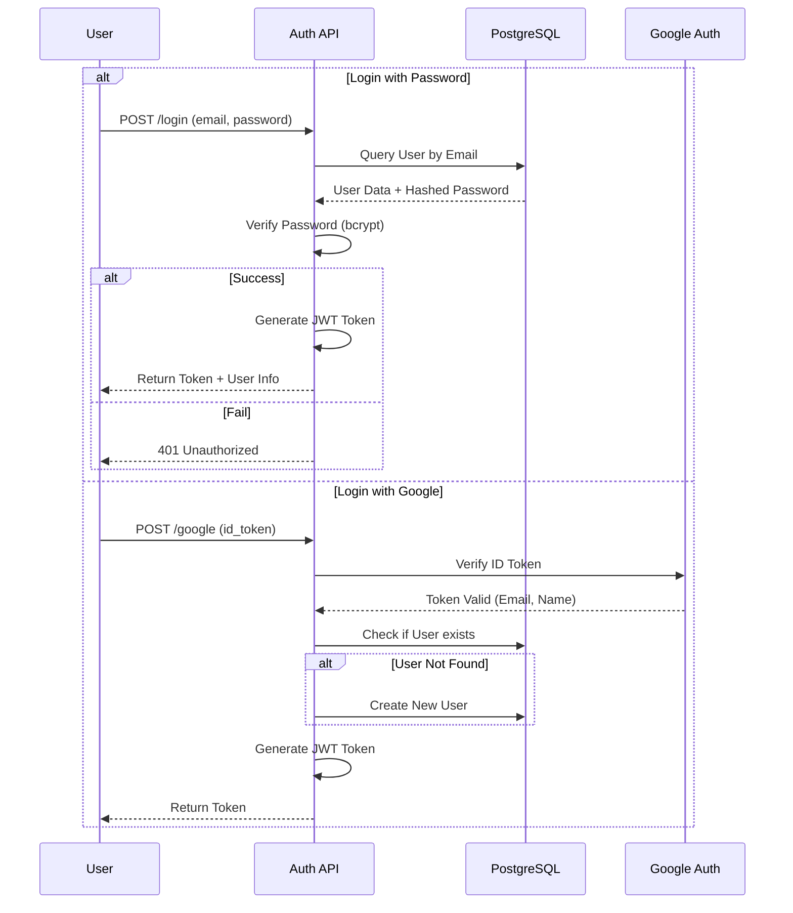
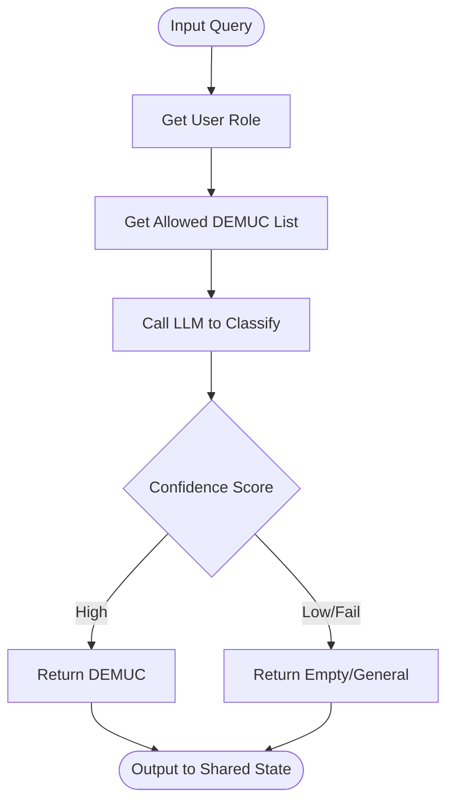

# 3.3. THIẾT KẾ LUỒNG XỬ LÝ (ACTIVITY DIAGRAM)

## 3.3.1. Luồng xử lý chính - MedFlow

Hệ thống sử dụng **PocketFlow** làm nền tảng xử lý luồng (Workflow Engine). Luồng chính `MedFlow` điều phối quá trình từ khi nhận câu hỏi của người dùng đến khi trả lời và lưu trữ bộ nhớ.

### Activity Diagram (Medical Conversation Flow)

```mermaid
graph TD
    Start((Start)) --> Ingest[IngestQuery<br>Nhận & Chuẩn hóa câu hỏi]
    Ingest --> RetrieveMem[RetrieveFromMemory<br>Lấy ngữ cảnh quá khứ]
    RetrieveMem --> Decide[DecideSummarizeConversation<br>Phân tích nhu cầu truy vấn]

    Decide -- "Trả lời trực tiếp" --> MemoryMgr[SaveToMemory (MemoryManager)<br>Quản lý bộ nhớ]
    Decide -- "Cần RAG" --> RagAgent[RagAgent<br>Xử lý Query Expansion]

    RagAgent -- "Tạo Query mới" --> BetterQuery[QueryCreatingForRetrievalAgent<br>Tối ưu câu truy vấn]
    BetterQuery --> RetrieveKB[RetrieveFromKB<br>Truy vấn Knowledge Base]

    RagAgent -- "Dùng Query gốc" --> TopicClassify[TopicClassifyAgent<br>Phân loại chủ đề]
    TopicClassify --> RetrieveKB

    RetrieveKB --> CheckLoop{Đủ thông tin?}
    CheckLoop -- "Chưa đủ (Loop)" --> RagAgent
    CheckLoop -- "Đã đủ" --> Compose[ComposeAnswer<br>Tổng hợp câu trả lời]

    RagAgent -- "Direct Compose" --> Compose

    Compose --> MemoryMgr

    MemoryMgr --> AddMem[AddMemory]
    MemoryMgr --> UpdateMem[UpdateMemory]
    MemoryMgr --> DeleteMem[DeleteMemory]

    AddMem --> End((End))
    UpdateMem --> End
    DeleteMem --> End

    %% Fallback paths
    Decide -.-> Fallback[FallbackNode<br>Xử lý lỗi]
    RagAgent -.-> Fallback
    RetrieveKB -.-> Fallback
    Compose -.-> Fallback

    Fallback --> End
```

### Mô tả chi tiết các bước (Nodes)

1.  **IngestQuery**: Tiếp nhận câu hỏi từ API, chuẩn hóa văn bản, lấy thông tin User ID và Thread ID.
2.  **RetrieveFromMemory**: Truy vấn `user_memory` trong Qdrant để lấy các thông tin liên quan từ lịch sử trò chuyện cũ (sở thích, bệnh sử đã khai báo).
3.  **DecideSummarizeConversationToRetriveOrDirectlyAnswer**: Sử dụng LLM để đánh giá xem câu hỏi có cần tra cứu kiến thức y khoa (RAG) hay có thể trả lời ngay (ví dụ: chào hỏi, câu hỏi cá nhân).
4.  **RagAgent**: Đóng vai trò điều phối RAG. Nó có thể quyết định thực hiện Query Expansion (mở rộng câu truy vấn) hoặc gửi thẳng đến bộ phân loại.
5.  **TopicClassifyAgent**: Phân loại câu hỏi vào các danh mục (DEMUC) cụ thể (ví dụ: Nội tiết, Tim mạch) để thu hẹp phạm vi tìm kiếm.
6.  **RetrieveFromKB (With/Without Demuc)**: Thực hiện tìm kiếm vector (Hybrid Search) trong Qdrant Knowledge Base. Kết hợp Dense Embedding (ý nghĩa), Sparse Embedding (từ khóa BM25) và Late Interaction (ColBERT) để lấy các đoạn văn bản phù hợp nhất.
7.  **ComposeAnswer**: Tổng hợp ngữ cảnh từ Memory và Knowledge Base, sử dụng LLM (Gemini) để sinh ra câu trả lời cuối cùng cho người dùng.
8.  **SaveToMemory (MemoryManager)**: Phân tích hội thoại vừa diễn ra để quyết định cập nhật bộ nhớ dài hạn. Node này điều phối các worker nodes:
    *   **AddMemory**: Thêm thông tin mới.
    *   **UpdateMemory**: Cập nhật thông tin đã thay đổi.
    *   **DeleteMemory**: Xóa thông tin sai hoặc lỗi thời.
9.  **FallbackNode**: Node dự phòng, bắt các lỗi ngoại lệ (API overload, network error) để trả về thông báo lỗi thân thiện thay vì làm crash hệ thống.

---

## 3.3.2. Các luồng phụ (Sub-flows)

### a. Luồng Authentication (Xác thực)

Quy trình xác thực người dùng thông qua Email/Password hoặc Google OAuth.



### b. Luồng Load Embeddings (Nạp dữ liệu)

Quy trình xử lý dữ liệu thô (CSV) thành vector và lưu vào Qdrant.

```mermaid
graph LR
    Input[CSV Files] --> Load[Load Script]
    Load --> Models[Load Models<br>(Dense, Sparse, ColBERT)]

    Models --> Process[Process Row]
    Process --> Clean[Clean Text<br>& Expand Abbreviations]
    Clean --> Embed[Generate Embeddings]

    Embed --> Dense[Dense Vector<br>MiniLM-L6-v2]
    Embed --> Sparse[Sparse Vector<br>BM25]
    Embed --> Late[Late Interaction<br>ColBERTv2.0]

    Dense & Sparse & Late --> Upsert[Upsert to Qdrant]
    Upsert --> Done[Collection Ready]
```

### c. Luồng Topic Classification (Phân loại chủ đề)

Chi tiết cách `TopicClassifyAgent` hoạt động để định hướng tìm kiếm.


