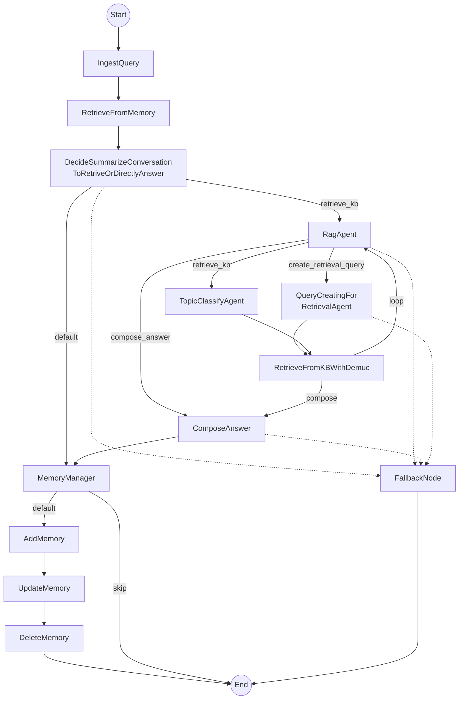
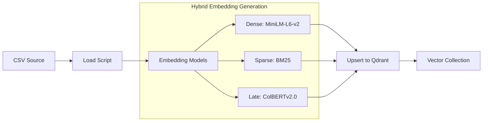
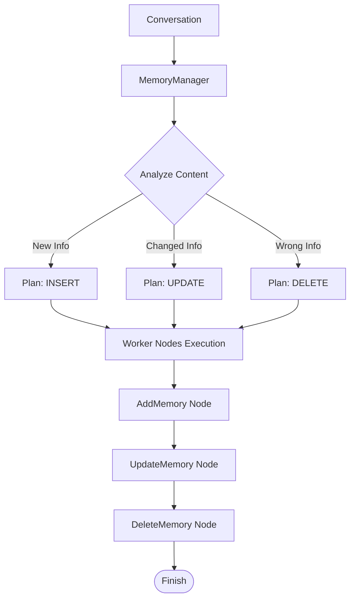

# 3.3. THIẾT KẾ LUỒNG XỬ LÝ (ACTIVITY DIAGRAM)

## 3.3.1. Luồng xử lý chính - MedFlow

Hệ thống sử dụng **PocketFlow** làm nền tảng xử lý luồng (Workflow Engine). Luồng chính `MedFlow` được thiết kế theo kiến trúc hướng sự kiện, với `RagAgent` đóng vai trò trung tâm điều phối và `MemoryManager` quản lý bộ nhớ dài hạn.

### Activity Diagram (Medical Conversation Flow)



### Mô tả chi tiết các Node

| Node | Chức năng | Input/Output chính |
| :--- | :--- | :--- |
| **IngestQuery** | Tiếp nhận request, khởi tạo session, chuẩn hóa input. | In: `query`, `user_id`<br>Out: `normalized_query` |
| **RetrieveFromMemory** | Tìm kiếm thông tin liên quan từ `user_memory` (Qdrant) dựa trên query hiện tại. | Out: `relevant_memories` |
| **DecideSummarize...** | LLM Router quyết định: trả lời ngay (chào hỏi) hay cần RAG (hỏi bệnh). | Out: `action` ("retrieve_kb" / "default") |
| **RagAgent** | Agent trung tâm điều phối chiến lược RAG. Phân tích ngữ cảnh để chọn: tạo query mới, phân loại chủ đề, hay trả lời luôn. | In: `rag_history`, `context`<br>Out: `rag_action` |
| **QueryCreating...** | (Optional) Viết lại câu truy vấn tốt hơn để tăng độ chính xác tìm kiếm vector. | Out: `retrieval_query` |
| **TopicClassifyAgent** | Phân loại câu hỏi vào danh mục y khoa (DEMUC) để lọc dữ liệu tìm kiếm. | Out: `demuc` |
| **RetrieveFromKB...** | Thực hiện Hybrid Search (Dense + Sparse + ColBERT) vào Knowledge Base. | Out: `kb_context` |
| **ComposeAnswer** | Tổng hợp câu trả lời cuối cùng từ Context và Memory. | Out: `final_answer` |
| **MemoryManager** | Phân tích hội thoại để xác định các thao tác cần làm với bộ nhớ (Insert/Update/Delete). | Out: `memory_operations` |
| **Add/Update/DeleteMemory** | Các worker nodes thực thi thao tác cụ thể lên Qdrant `user_memory`. | - |

---

## 3.3.2. Các luồng phụ (Sub-flows)

### a. Luồng Authentication (Xác thực)

Hệ thống sử dụng cơ chế xác thực JWT (JSON Web Token) kết hợp với mật khẩu được mã hóa (hashing) trong PostgreSQL. Không sử dụng dịch vụ bên thứ 3 (Google/Facebook).

#### Luồng Đăng ký (Registration)

```mermaid
flowchart TD
    Start((Start)) --> Input[User nhập Email & Password]
    Input --> Validate{Validate Input?}

    Validate -- Invalid --> Error[Trả lỗi 400: Bad Request]
    Validate -- Valid --> CheckExist{Email tồn tại trong DB?}

    CheckExist -- Yes --> ErrorExist[Trả lỗi 400: Email exists]
    CheckExist -- No --> Hash[Hash Password (bcrypt)]

    Hash --> Save[Lưu User vào PostgreSQL]
    Save --> Success((End: Đăng ký thành công))

    Error --> End((End))
    ErrorExist --> End
```

#### Luồng Đăng nhập (Login)

```mermaid
flowchart TD
    Start((Start)) --> Input[User nhập Email & Password]
    Input --> FindUser{Tìm User trong DB}

    FindUser -- Not Found --> AuthFail[Trả lỗi 401: Sai thông tin]
    FindUser -- Found --> VerifyPass{Verify Password (bcrypt)}

    VerifyPass -- Fail --> AuthFail
    VerifyPass -- Success --> GenToken[Tạo JWT Access Token]

    GenToken --> Return[Trả về Token + User Info]
    Return --> End((End))
    AuthFail --> End
```

#### Luồng Xác thực JWT (Authentication Middleware)

Mô tả cách hệ thống sử dụng JWT để bảo vệ các API (như Chat, History).

```mermaid
flowchart TD
    Start((API Request)) --> CheckHeader{Có Header Authorization?}

    CheckHeader -- No --> Deny[401 Unauthorized: Missing Token]
    CheckHeader -- Yes --> Extract[Extract Token (Bearer ...)]

    Extract --> Decode{Decode & Verify Signature}

    Decode -- Fail/Expired --> DenyToken[401 Unauthorized: Invalid Token]
    Decode -- Success --> GetID[Lấy User ID từ Payload]

    GetID --> Inject[Gán User ID vào Request Context]
    Inject --> Next[Chuyển tiếp đến Controller]

    Next --> End((End))
    Deny --> End
    DenyToken --> End
```

### b. Luồng Load Embeddings (Knowledge Base)

Quy trình nạp dữ liệu y khoa từ CSV vào Qdrant với chiến lược Hybrid Search.



### c. Luồng Memory Management (Chi tiết)

Cách `MemoryManager` điều phối việc lưu trữ thông tin người dùng.


