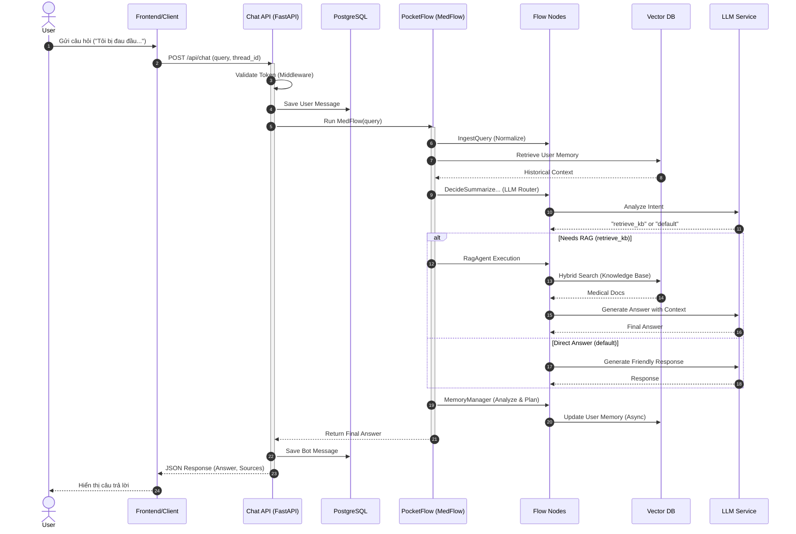
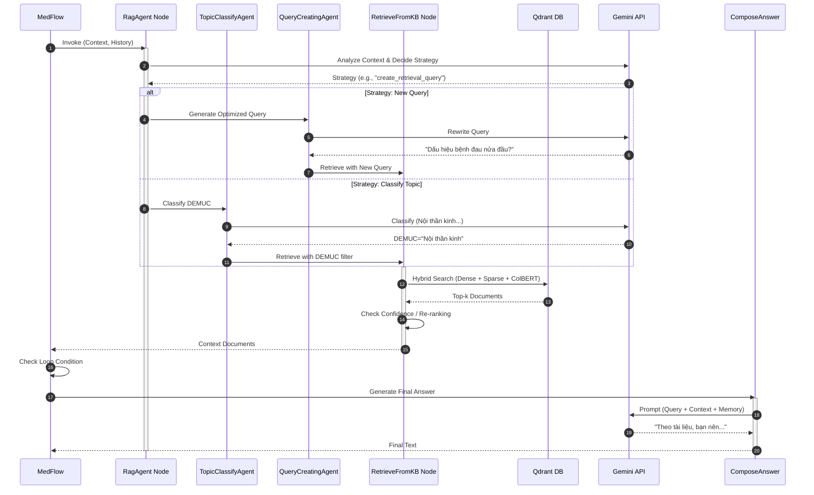
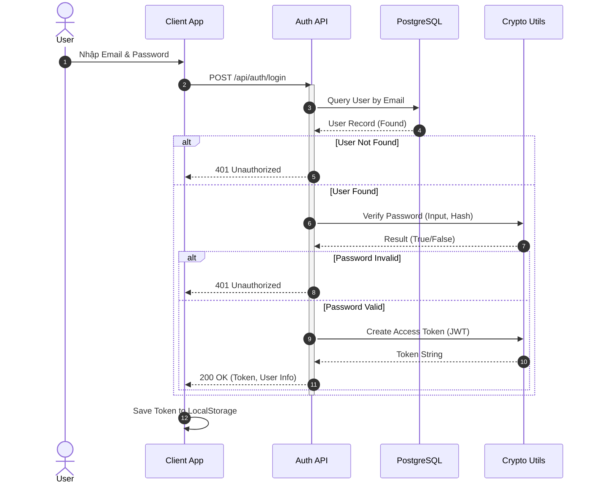
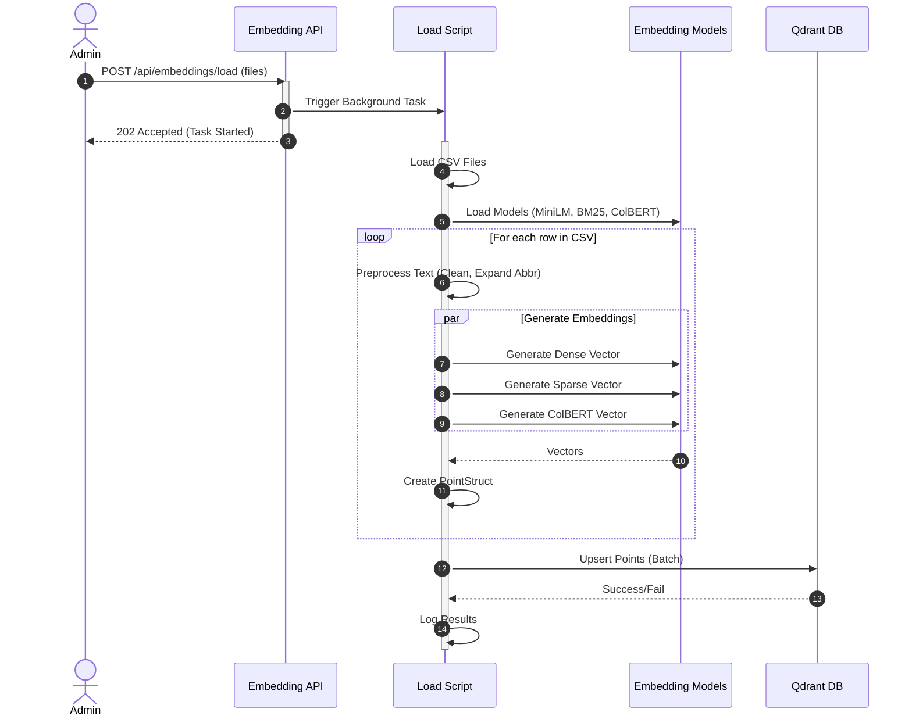

# 3.4. THIẾT KẾ SEQUENCE DIAGRAM (BIỂU ĐỒ TUẦN TỰ)

Mục này mô tả chi tiết sự tương tác giữa các đối tượng trong hệ thống theo thời gian cho các chức năng quan trọng.

## 3.4.1. Sequence: User Chat Flow (Luồng Chat Tổng Quát)

Mô tả luồng tương tác từ khi người dùng gửi tin nhắn đến khi nhận được câu trả lời.

## 3.4.2. Sequence: RAG Retrieval Flow (Chi tiết luồng RAG)

Mô tả chi tiết các bước bên trong `RagAgent` và các node liên quan khi thực hiện truy vấn kiến thức y khoa.

## 3.4.3. Sequence: Authentication Flow (Đăng nhập)

Mô tả quá trình đăng nhập sử dụng Email và Password (PostgreSQL only).

## 3.4.4. Sequence: Embedding Load Flow (Nạp dữ liệu)

Mô tả quá trình Admin nạp dữ liệu từ file CSV vào Vector Database.

