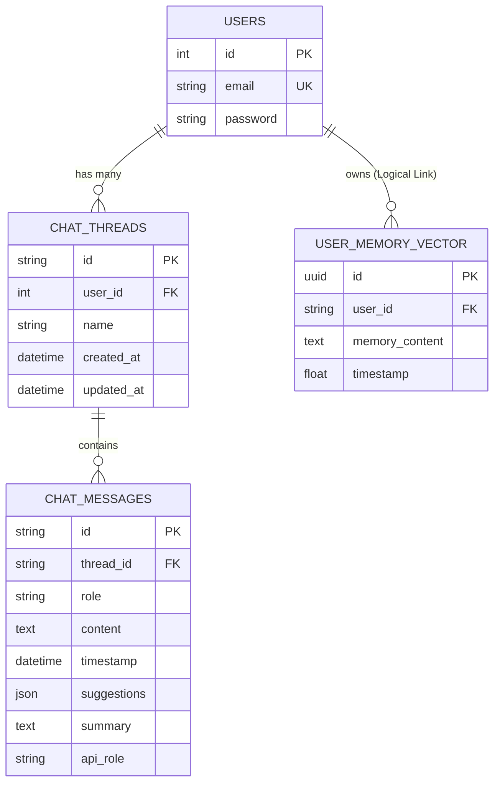

# 3.6. THIẾT KẾ DATABASE

## 3.6.1. Entity-Relationship Diagram (ERD)

Sơ đồ quan hệ thực thể mô tả cấu trúc dữ liệu quan hệ trong PostgreSQL (lưu trữ Users, Threads, Messages) và mối quan hệ logic với dữ liệu Vector (User Memory).



*Ghi chú: `USER_MEMORY_VECTOR` được lưu trữ trong Qdrant Vector DB, nhưng có liên kết logic với `USERS` thông qua `user_id`.*

## 3.6.2. Schema chi tiết (PostgreSQL)

Dưới đây là thiết kế chi tiết các bảng trong cơ sở dữ liệu quan hệ PostgreSQL.

### 1. Table `users`
Lưu trữ thông tin tài khoản người dùng.

| Column | Type | Constraints | Description |
| :--- | :--- | :--- | :--- |
| **id** | INTEGER | PRIMARY KEY, AUTO_INCREMENT | ID duy nhất của user |
| **email** | VARCHAR(255) | UNIQUE, NOT NULL | Email đăng nhập |
| **password** | VARCHAR(255) | NOT NULL | Mật khẩu đã mã hóa (bcrypt) |

### 2. Table `chat_threads`
Quản lý các cuộc hội thoại (threads) của người dùng.

| Column | Type | Constraints | Description |
| :--- | :--- | :--- | :--- |
| **id** | VARCHAR(36) | PRIMARY KEY | UUID của thread |
| **user_id** | INTEGER | FOREIGN KEY (`users.id`) | ID của user sở hữu (On Delete Cascade) |
| **name** | VARCHAR(255) | NOT NULL | Tên/Tiêu đề cuộc trò chuyện |
| **created_at** | DATETIME | DEFAULT NOW() | Thời điểm tạo |
| **updated_at** | DATETIME | DEFAULT NOW() | Thời điểm cập nhật cuối cùng |

### 3. Table `chat_messages`
Lưu trữ nội dung tin nhắn trong từng cuộc hội thoại.

| Column | Type | Constraints | Description |
| :--- | :--- | :--- | :--- |
| **id** | VARCHAR(36) | PRIMARY KEY | UUID của message |
| **thread_id** | VARCHAR(36) | FOREIGN KEY (`chat_threads.id`) | ID của thread chứa tin nhắn |
| **role** | VARCHAR(20) | NOT NULL | Vai trò: 'user' hoặc 'bot' |
| **content** | TEXT | NOT NULL | Nội dung tin nhắn |
| **timestamp** | DATETIME | DEFAULT NOW() | Thời điểm gửi |
| **api_role** | VARCHAR(50) | NULLable | Vai trò cụ thể trong API (nếu có) |
| **suggestions** | JSON | NULLable | Gợi ý câu hỏi tiếp theo (nếu có) |
| **summary** | TEXT | NULLable | Tóm tắt nội dung (nếu có) |
| **need_clarify** | BOOLEAN | NULLable | Cờ đánh dấu cần làm rõ thông tin |

---

## 3.6.3. Vector Database Schema (Qdrant)

Hệ thống sử dụng **Qdrant** để lưu trữ và tìm kiếm vector cho cả Knowledge Base (Kiến thức y khoa) và User Memory (Bộ nhớ người dùng). Chiến lược **Hybrid Search** được áp dụng thống nhất.

### Cấu hình Vector (Chung cho các Collection)

Mỗi Point trong Qdrant lưu trữ 3 loại vector để phục vụ tìm kiếm lai (Hybrid Search):

| Tên Vector | Model sử dụng | Kích thước | Loại | Mục đích |
| :--- | :--- | :--- | :--- | :--- |
| **all-MiniLM-L6-v2** | `sentence-transformers/all-MiniLM-L6-v2` | 384 | Dense | Tìm kiếm ngữ nghĩa (Semantic Search) |
| **bm25** | `Qdrant/bm25` | - | Sparse | Tìm kiếm từ khóa (Keyword Search) |
| **colbertv2.0** | `colbert-ir/colbertv2.0` | 128 | Late Interaction | Tinh chỉnh kết quả (Reranking) độ chính xác cao |

### 1. Collections Knowledge Base
Dữ liệu y khoa được chia thành các collection riêng biệt tương ứng với các file nguồn: `bndtd`, `bsnt`, `bnrhm`, `bsrhm`.

**Payload Schema:**
```json
{
  "DEMUC": "String - Danh mục bệnh học (Ví dụ: Nội tiết)",
  "CHUDECON": "String - Chủ đề con (nếu có)",
  "CAUHOI": "String - Câu hỏi/Vấn đề y khoa (đã mở rộng từ viết tắt)",
  "CAUTRALOI": "String - Nội dung kiến thức/Câu trả lời gốc",
  "GIAITHICH": "String - Giải thích chi tiết (nếu có)"
}
```

**Indexing Strategy:**
- Payload Index trên trường `DEMUC` để lọc nhanh theo chủ đề.
- Full-text Index trên `CAUHOI` và `CAUTRALOI` (nếu cần tìm kiếm văn bản thuần túy).

### 2. Collection `user_memory`
Lưu trữ thông tin cá nhân và ngữ cảnh quan trọng được trích xuất từ các cuộc hội thoại của user.

**Payload Schema:**
```json
{
  "user_id": "String/Int - ID của người dùng (dùng để lọc)",
  "query": "String - Nội dung memory (Ví dụ: 'User bị dị ứng Penicillin')",
  "timestamp": "Float - Thời điểm tạo memory"
}
```

**Indexing Strategy:**
- **Filter Index** bắt buộc trên trường `user_id` để đảm bảo mỗi user chỉ truy xuất được memory của chính mình.
