# Design Doc: Medical Agent Flow (`create_med_agent_flow`)

> Please DON'T remove notes for AI

## Requirements

> Notes for AI: Keep it simple and clear.
> If the requirements are abstract, write concrete user stories

The medical agent flow serves as a multi-agent system for handling medical consultations with specialized retrieval and answer composition capabilities. The system must:

1. **User Story**: As a patient, I want to ask medical questions and receive accurate, evidence-based responses with relevant knowledge base references.
2. **User Story**: As a user, I want the system to intelligently classify topics (DEMUC categories) and retrieve only the most relevant information.
3. **User Story**: As a user, I want the system to remain functional even when AI APIs are overloaded, providing fallback responses from the knowledge base.
4. **User Story**: As a user, I want the system to handle direct responses (greetings, chitchat) without unnecessary knowledge base queries.

## Flow Design

> Notes for AI:
> 1. Consider the design patterns of agent, map-reduce, rag, and workflow. Apply them if they fit.
> 2. Present a concise, high-level description of the workflow.

### Applicable Design Pattern:

1. **Agent Pattern**: Multiple specialized agents (DecideToRetriveOrAnswer, TopicClassifyAgent, RagAgent, FilterAgent) collaborate to process queries
2. **RAG Pattern**: `RetrieveFromKB` → `FilterAgent` → `RagAgent` → `ComposeAnswer` implements advanced retrieval-augmented generation
3. **Sub-Flow Pattern**: Reusable `retrieve_flow` encapsulates the retrieval pipeline (TopicClassify → Retrieve → Filter)
4. **Workflow Pattern**: Complex medical consultation workflow with conditional branching and retry logic
5. **Graceful Degradation**: FallbackNode ensures system reliability during API overload

### Flow High-level Design:

1. **IngestQuery**: Standardizes input processing, formats conversation history
2. **DecideToRetriveOrAnswer**: Intelligent LLM-based classification with context summarization (direct_response vs retrieve_kb)
3. **RagAgent**: Orchestration agent that decides next action (create_retrieval_query, retrieve_kb, compose_answer)
4. **QueryCreatingForRetrievalAgent**: Creates optimized retrieval query from conversation context
5. **Retrieve Sub-Flow**: Modular retrieval pipeline
   - **TopicClassifyAgent**: Classifies query into DEMUC and CHU_DE_CON categories
   - **RetrieveFromKB**: Fetches relevant QA IDs from Qdrant vector database
   - **FilterAgent**: Filters and selects most relevant QA IDs using LLM
6. **ComposeAnswer**: Generates comprehensive medical responses with structured output
7. **FallbackNode**: Robust API overload handling

```mermaid
flowchart TD
    IngestQuery[IngestQuery<br/>📝 Input Processing]
    MainDecision[DecideToRetriveOrAnswer<br/>🧠 Classification & Context Summary]
    RagAgent[RagAgent<br/>🎯 Orchestration Decision Agent]
    QueryOptimizer[QueryCreatingForRetrievalAgent<br/>🔧 Query Optimization]

    subgraph RetrieveFlow[Retrieve Sub-Flow]
        TopicClassify[TopicClassifyAgent<br/>🏷️ DEMUC & CHU_DE_CON Classification]
        RetrieveKB[RetrieveFromKB<br/>📚 Vector Search Qdrant]
        FilterAgent[FilterAgent<br/>🔍 LLM-based Candidate Filtering]

        TopicClassify --> RetrieveKB
        RetrieveKB --> FilterAgent
    end

    ComposeAnswer[ComposeAnswer<br/>✍️ Response Generation]
    Fallback[FallbackNode<br/>🔄 Fallback Handling]

    IngestQuery --> MainDecision
    MainDecision -- "direct_response" --> END[Flow Ends]
    MainDecision -- "retrieve_kb" --> RagAgent
    MainDecision -- "fallback" --> Fallback

    RagAgent -- "create_retrieval_query" --> QueryOptimizer
    QueryOptimizer --> RetrieveFlow
    RagAgent -- "retrieve_kb" --> RetrieveFlow
    RetrieveFlow --> RagAgent
    RagAgent -- "compose_answer" --> ComposeAnswer

    RetrieveFlow -- "fallback" --> Fallback
    RagAgent -- "fallback" --> Fallback
    QueryOptimizer -- "fallback" --> Fallback
    ComposeAnswer -- "fallback" --> Fallback
```



## Utility Functions

> Notes for AI:
> 1. Understand the utility function definition thoroughly by reviewing the doc.
> 2. Include only the necessary utility functions, based on nodes in the flow.

1. **Call LLM** (`utils/llm/call_llm.py`)
   - *Input*: prompt (str), optional fast_mode (bool), max_retry_time (int)
   - *Output*: response (str)
   - Used by most nodes (DecideToRetriveOrAnswer, RagAgent, TopicClassifyAgent, FilterAgent, QueryCreatingForRetrievalAgent, ComposeAnswer) for LLM operations
   - Handles APIOverloadException for graceful degradation

2. **Qdrant Vector Retrieval** (`utils/knowledge_base/qdrant_retrieval.py`)
   - Functions: `retrieve_from_qdrant`, `get_full_qa_by_ids`
   - *Input*: query (str), demuc (str), chu_de_con (str), collection_name (str), top_k (int)
   - *Output*: List[Dict] with {id, CAUHOI, score} or full QA pairs
   - Used by RetrieveFromKB to fetch candidates from vector database and by ComposeAnswer to get full QA content

3. **Topic Classification** (`utils/llm/classify_topic.py`)
   - Functions: `classify_demuc_with_llm`, `classify_chu_de_con_with_llm`
   - *Input*: query (str), role (str), demuc_list_str/chu_de_con_list_str (str)
   - *Output*: Dict with {demuc/chu_de_con, confidence, reason}
   - Used by TopicClassifyAgent for hierarchical topic classification

4. **Metadata Utils** (`utils/knowledge_base/metadata_utils.py`)
   - Functions: `get_demuc_list_for_role`, `get_chu_de_con_for_demuc`, `format_demuc_list_for_prompt`
   - *Input*: role (str), demuc (str)
   - *Output*: List of available DEMUC/CHU_DE_CON categories
   - Used by TopicClassifyAgent to get valid classification options

5. **Response Parser** (`utils/parsing/response_parser.py`)
   - Function: `parse_yaml_with_schema`
   - *Input*: yaml_text (str), required_fields (List), optional_fields (List), field_types (Dict)
   - *Output*: parsed_dict (Dict)
   - Used by all LLM-calling nodes for structured YAML output parsing with validation

6. **Format Helpers** (`utils/helpers.py`)
   - Functions: `format_kb_qa_list`, `format_conversation_history`
   - *Input*: QA list or conversation history
   - *Output*: Formatted strings for prompts
   - Used across multiple nodes for consistent data presentation

## Node Design

### Shared Store

> Notes for AI: Try to minimize data redundancy

The shared store structure is organized as follows:

```python
shared = {
    # Input data
    "input": str,                    # Raw user input
    "role": str,                     # User's medical role (e.g., patient_diabetes, patient_dental)
    "conversation_history": List[Dict],  # Previous conversation context with {role, content}
    
    # Processed input data
    "query": str,                    # Original processed query from user
    "retrieval_query": str,          # Optimized query for retrieval (created by QueryCreatingForRetrievalAgent)
    "original_query": str,           # Backup of original query before optimization
    "formatted_conversation_history": str,  # Formatted conversation for prompt context
    "context_summary": str,          # LLM-generated summary of conversation context
    
    # Topic classification (hierarchical)
    "demuc": str,                    # Top-level category (e.g., "BỆNH LÝ ĐTĐ", "NHA KHOA")
    "chu_de_con": str,               # Sub-category under DEMUC (e.g., "Định nghĩa và phân loại")
    "classification_confidence": str, # Confidence level: high/medium/low
    
    # Retrieval pipeline data
    "retrieved_candidates": List[Dict],  # Lightweight candidates with {id, CAUHOI} from vector DB
    "selected_ids": List[str],       # IDs selected by FilterAgent (max 10)
    "selected_questions": List[str], # Question texts for selected IDs
    "rag_state": str,                # Current RAG state: init/retrieved/filtered/composing
    "retrieve_attempts": int,        # Counter for retrieval attempts (max 2)
    
    # Query optimization metadata
    "retrieval_query_confidence": str,  # Confidence of retrieval query: high/medium/low
    "retrieval_query_reason": str,   # Explanation of how retrieval query was created
    "create_retrieval_query_reason": str,  # Reason RagAgent decided to create new query
    
    # Output data
    "answer_obj": Dict,              # Complete response object with all fields
    "explain": str,                  # Main explanation text for user
    "suggestion_questions": List[str], # Follow-up question suggestions (3 items)
}
```

### Node Steps

> Notes for AI: Carefully decide whether to use Batch/Async Node/Flow.

1. **IngestQuery Node**
   - *Purpose*: Standardize input processing, format conversation history (last 6 messages)
   - *Type*: Regular Node
   - *Steps*:
     - *prep*: Read "input", "role", and "conversation_history" from shared store
     - *exec*: Process input, format conversation history into readable text
     - *post*: Write "role", "query", and "formatted_conversation_history" to shared store
   - *Actions*: "default" → MainDecision

2. **DecideSummarizeConversationToRetriveOrDirectlyAnswer Node**
   - *Purpose*: Classify input type and create conversation context summary using LLM
   - *Type*: Regular Node with API overload handling
   - *Steps*:
     - *prep*: Read "query", "role", and "formatted_conversation_history" from shared store
     - *exec*: Call LLM (fast_mode) to classify type (direct_response/retrieve_kb) and create context_summary
     - *post*: If direct_response: write "answer_obj" and return "direct_response"; If retrieve_kb: write "context_summary" and return "retrieve_kb"; If API overload: return "fallback"
   - *Actions*: "direct_response" → END, "retrieve_kb" → RagAgent, "fallback" → FallbackNode

3. **RagAgent Node** (Orchestration Agent)
   - *Purpose*: Intelligent orchestration of RAG pipeline - decides whether to optimize query, retrieve, or compose answer
   - *Type*: Regular Node with max_retries=2
   - *Steps*:
     - *prep*: Read "retrieval_query" or "query", "rag_state", "retrieve_attempts", "selected_questions", "context_summary" from shared store
     - *exec*: Call LLM (fast_mode) to decide next action based on current state and retrieved questions
     - *post*: Update "retrieve_attempts" and "rag_state"; route to create_retrieval_query/retrieve_kb/compose_answer
   - *Actions*: "create_retrieval_query" → QueryCreatingForRetrievalAgent, "retrieve_kb" → retrieve_flow, "compose_answer" → ComposeAnswer, "fallback" → FallbackNode

4. **QueryCreatingForRetrievalAgent Node**
   - *Purpose*: Create optimized retrieval query from conversation context and user input
   - *Type*: Regular Node with API overload handling
   - *Steps*:
     - *prep*: Read "retrieval_query" or "query", "role", "demuc", "chu_de_con", "context_summary", "create_retrieval_query_reason" from shared store
     - *exec*: Call LLM (fast_mode) to generate optimized retrieval_query with reasoning
     - *post*: Write "original_query", "retrieval_query", "retrieval_query_confidence", "retrieval_query_reason" to shared store
   - *Actions*: "default" → retrieve_flow, "fallback" → FallbackNode

5. **TopicClassifyAgent Node** (within retrieve_flow)
   - *Purpose*: Hierarchical topic classification - classify DEMUC and CHU_DE_CON sequentially with smart reset logic
   - *Type*: Regular Node with max_retries=3, wait=2
   - *Steps*:
     - *prep*: Read "retrieval_query" or "query", "role", "demuc", "chu_de_con", "rag_state" from shared store; Reset demuc/chu_de_con if rag_state == "create_retrieval_query_reason"
     - *exec*: If no demuc: get DEMUC list for role → call classify_demuc_with_llm; If no chu_de_con AND rag_state != "create_retrieval_query_reason": get CHU_DE_CON list → call classify_chu_de_con_with_llm
     - *post*: Write "demuc", "chu_de_con", "classification_confidence" to shared store
   - *Actions*: "default" → RetrieveFromKB, "fallback" → FallbackNode
   - *Note*: Smart reset prevents using stale topic metadata after query optimization

6. **RetrieveFromKB Node** (within retrieve_flow)
   - *Purpose*: Fetch relevant QA candidates from Qdrant vector database with metadata filtering
   - *Type*: Regular Node
   - *Steps*:
     - *prep*: Read "retrieval_query" or "query", "demuc", "chu_de_con", "role" from shared store
     - *exec*: Call retrieve_from_qdrant twice (with and without chu_de_con filter), deduplicate by ID, return lightweight candidates {id, CAUHOI}
     - *post*: Write "retrieved_candidates" and "rag_state"="retrieved" to shared store
   - *Actions*: "default" → FilterAgent, "fallback" → FallbackNode

7. **FilterAgent Node** (within retrieve_flow)
   - *Purpose*: Use LLM to filter and select most relevant QA IDs (max 10)
   - *Type*: Regular Node with API overload handling
   - *Steps*:
     - *prep*: Read "retrieval_query" or "query", "retrieved_candidates", "role" from shared store
     - *exec*: If ≤3 candidates: return all; else call LLM (fast_mode) to select top relevant IDs
     - *post*: Write "selected_ids", "selected_questions", "rag_state"="filtered" to shared store
   - *Actions*: "default" → back to RagAgent (end of retrieve_flow), "fallback" → FallbackNode

8. **ComposeAnswer Node**
   - *Purpose*: Generate comprehensive medical response with persona, sources, and suggestions
   - *Type*: Regular Node with fallback handling
   - *Steps*:
     - *prep*: Read "role", "retrieval_query" or "query", "selected_ids", "context_summary" from shared store; fetch full QA pairs using get_full_qa_by_ids()
     - *exec*: Call LLM with persona prompt to generate structured YAML response {explanation, suggestion_questions}
     - *post*: Parse YAML, write "answer_obj", "explain", "suggestion_questions" to shared store
   - *Actions*: "default" → END, "fallback" → FallbackNode

9. **FallbackNode**
   - *Purpose*: Minimal fallback for API overload - no LLM calls
   - *Type*: Regular Node (no exec logic)
   - *Steps*:
     - *prep*: Return None
     - *exec*: Return None
     - *post*: Write generic error message to "explain" and empty "suggestion_questions"
   - *Actions*: "default" → END
