# Design Doc: Medical Agent Flow (`create_med_agent_flow`)

> Please DON'T remove notes for AI

## Requirements

> Notes for AI: Keep it simple and clear.
> If the requirements are abstract, write concrete user stories

The medical agent flow serves as a multi-agent system for handling medical consultations with specialized retrieval and answer composition capabilities. The system must:

1. **User Story**: As a patient, I want to ask medical questions and receive accurate, evidence-based responses with relevant knowledge base references.
2. **User Story**: As a user, I want the system to intelligently classify topics (DEMUC categories) and retrieve only the most relevant information.
3. **User Story**: As a user, I want the system to remain functional even when AI APIs are overloaded, providing fallback responses from the knowledge base.
4. **User Story**: As a user, I want the system to handle direct responses (greetings, chitchat) without unnecessary knowledge base queries.

## Flow Design

> Notes for AI:
> 1. Consider the design patterns of agent, map-reduce, rag, and workflow. Apply them if they fit.
> 2. Present a concise, high-level description of the workflow.

### Applicable Design Pattern:

1. **Agent Pattern**: Multiple specialized agents (DecideToRetriveOrAnswer, TopicClassifyAgent, RagAgent, FilterAgent) collaborate to process queries
2. **RAG Pattern**: `RetrieveFromKB` → `FilterAgent` → `RagAgent` → `ComposeAnswer` implements advanced retrieval-augmented generation
3. **Sub-Flow Pattern**: Reusable `retrieve_flow` encapsulates the retrieval pipeline (TopicClassify → Retrieve → Filter)
4. **Workflow Pattern**: Complex medical consultation workflow with conditional branching and retry logic
5. **Graceful Degradation**: FallbackNode ensures system reliability during API overload

### Flow High-level Design:

1. **IngestQuery**: Standardizes input processing and role validation
2. **DecideToRetriveOrAnswer**: Intelligent LLM-based classification (direct_response vs retrieve_kb)
3. **Retrieve Sub-Flow**: Modular retrieval pipeline
   - **TopicClassifyAgent**: Classifies query into DEMUC categories
   - **RetrieveFromKB**: Fetches relevant documents from knowledge base
   - **FilterAgent**: Filters and ranks retrieved candidates
4. **RagAgent**: Analyzes filtered results and decides next action (compose_answer, retry_retrieve, fallback)
5. **ComposeAnswer**: Generates comprehensive medical responses with structured output
6. **FallbackNode**: Robust API overload handling with direct KB lookup

```mermaid
flowchart TD
    IngestQuery[IngestQuery<br/>📝 Input Processing]
    MainDecision[DecideToRetriveOrAnswer<br/>🧠 Classification]

    subgraph RetrieveFlow[Retrieve Sub-Flow]
        TopicClassify[TopicClassifyAgent<br/>🏷️ DEMUC Classification]
        RetrieveKB[RetrieveFromKB<br/>📚 Knowledge Retrieval]
        FilterAgent[FilterAgent<br/>🔍 Candidate Filtering]

        TopicClassify --> RetrieveKB
        RetrieveKB --> FilterAgent
    end

    RagAgent[RagAgent<br/>  Decision Agent]
    ComposeAnswer[ComposeAnswer<br/>✍️ Response Generation]
    Fallback[FallbackNode<br/>🔄 Fallback Handling]

    IngestQuery --> MainDecision
    MainDecision -- "direct_response" --> END[Flow Ends]
    MainDecision -- "retrieve_kb" --> RetrieveFlow
    MainDecision -- "fallback" --> Fallback

    RetrieveFlow --> RagAgent
    RetrieveFlow -- "fallback" --> Fallback

    RagAgent -- "compose_answer" --> ComposeAnswer
    RagAgent -- "retry_retrieve" --> RetrieveFlow
    RagAgent -- "fallback" --> Fallback

    ComposeAnswer -- "fallback" --> Fallback
```



## Utility Functions

> Notes for AI:
> 1. Understand the utility function definition thoroughly by reviewing the doc.
> 2. Include only the necessary utility functions, based on nodes in the flow.

1. **Call LLM** (`utils/call_llm.py`)
   - *Input*: prompt (str), optional fast_mode (bool)
   - *Output*: response (str)
   - Used by DecideToRetriveOrAnswer, ComposeAnswer, and ChitChatRespond for LLM operations
   - Handles APIOverloadException for graceful degradation

2. **Knowledge Base Retrieval** (`utils/kb.py`)
   - *Input*: query (str), role (str), top_k (int)
   - *Output*: (results: List[Dict], best_score: float)
   - Used by RetrieveFromKB and FallbackNode for semantic search

3. **Response Parser** (`utils/response_parser.py`)
   - *Input*: yaml_text (str), required_fields (List), field_types (Dict)
   - *Output*: parsed_dict (Dict)
   - Used by DecideToRetriveOrAnswer and ComposeAnswer for structured LLM output parsing

4. **Format Helpers** (`utils/helpers.py`)
   - *Input*: Various formatting inputs (QA lists, conversation history)
   - *Output*: Formatted strings for prompts
   - Used across multiple nodes for consistent data presentation

## Node Design

### Shared Store

> Notes for AI: Try to minimize data redundancy

The shared store structure is organized as follows:

```python
shared = {
    # Input data
    "input": str,                    # Raw user input
    "role": str,                     # User's medical role (e.g., patient_diabetes)
    "conversation_history": List[Dict],  # Previous conversation context

    # Processing data
    "query": str,                    # Processed/cleaned query
    "input_type": str,              # Classification result (medical_question, direct_response)
    "direct_response": str,         # Direct answer for non-medical queries

    # Topic classification
    "topic_category": str,          # DEMUC category (Diabetes, Endocrine, etc.)
    "classification_confidence": float,  # Topic classification confidence

    # Retrieval data
    "retrieved_candidates": List[Dict],  # Raw knowledge base results
    "filtered_candidates": List[Dict],   # Filtered and ranked results
    "retrieval_score": float,           # Best retrieval score
    "top_k_candidates": int,            # Number of candidates to retrieve

    # RAG decision
    "rag_decision": str,            # Action: compose_answer, retry_retrieve, fallback
    "rag_reason": str,             # Reasoning for RAG decision

    # Output data
    "answer_obj": Dict,            # Complete response object with explain & suggestions
    "explain": str,                # Main explanation text
    "suggestion_questions": List[str], # Follow-up question suggestions
}
```

### Node Steps

> Notes for AI: Carefully decide whether to use Batch/Async Node/Flow.

1. **IngestQuery Node**
   - *Purpose*: Standardize input processing and extract role/query information
   - *Type*: Regular Node
   - *Steps*:
     - *prep*: Read "input" and "role" from shared store
     - *exec*: Process and validate input data, create structured result
     - *post*: Write "role" and "query" to shared store

2. **DecideToRetriveOrAnswer Node**
   - *Purpose*: Intelligent classification of user input using LLM
   - *Type*: Regular Node with retry mechanism
   - *Steps*:
     - *prep*: Read "query", "role", and "conversation_history" from shared store
     - *exec*: Call LLM for input classification (direct_response vs retrieve_kb)
     - *post*: Write "input_type" and "direct_response" (if applicable), route accordingly

3. **TopicClassifyAgent Node** (within retrieve_flow)
   - *Purpose*: Classify medical query into DEMUC categories
   - *Type*: Regular Node with LLM
   - *Steps*:
     - *prep*: Read "query" from shared store
     - *exec*: Call LLM to classify into Diabetes/Endocrine/Metabolism/Urology/Cardiovascular
     - *post*: Write "topic_category" and "classification_confidence" to shared store

4. **RetrieveFromKB Node** (within retrieve_flow)
   - *Purpose*: Fetch relevant documents from knowledge base
   - *Type*: Regular Node
   - *Steps*:
     - *prep*: Read "query", "topic_category", and "top_k_candidates" from shared store
     - *exec*: Query Qdrant vector DB with topic filtering
     - *post*: Write "retrieved_candidates" and "retrieval_score" to shared store

5. **FilterAgent Node** (within retrieve_flow)
   - *Purpose*: Filter and rank retrieved candidates using LLM
   - *Type*: Regular Node with LLM
   - *Steps*:
     - *prep*: Read "query" and "retrieved_candidates" from shared store
     - *exec*: Use LLM to assess relevance and rank candidates
     - *post*: Write "filtered_candidates" to shared store

6. **RagAgent Node**
   - *Purpose*: Analyze filtered results and decide next action
   - *Type*: Regular Node with LLM
   - *Steps*:
     - *prep*: Read "query", "filtered_candidates", and retrieval metadata
     - *exec*: Evaluate quality, decide: compose_answer, retry_retrieve, or fallback
     - *post*: Write "rag_decision" and "rag_reason", route accordingly

7. **ComposeAnswer Node**
   - *Purpose*: Generate comprehensive medical responses with suggestions
   - *Type*: Regular Node with fallback handling
   - *Steps*:
     - *prep*: Read role, query, filtered_candidates, and conversation history
     - *exec*: Call LLM for structured response generation with persona
     - *post*: Write "answer_obj" with explain and suggestion_questions, handle API overload

8. **FallbackNode**
   - *Purpose*: Robust fallback mechanism for API overload scenarios
   - *Type*: Regular Node (no LLM calls)
   - *Steps*:
     - *prep*: Read query, role, and topic information
     - *exec*: Direct knowledge base lookup with exact matching
     - *post*: Write fallback response with generic suggestions
