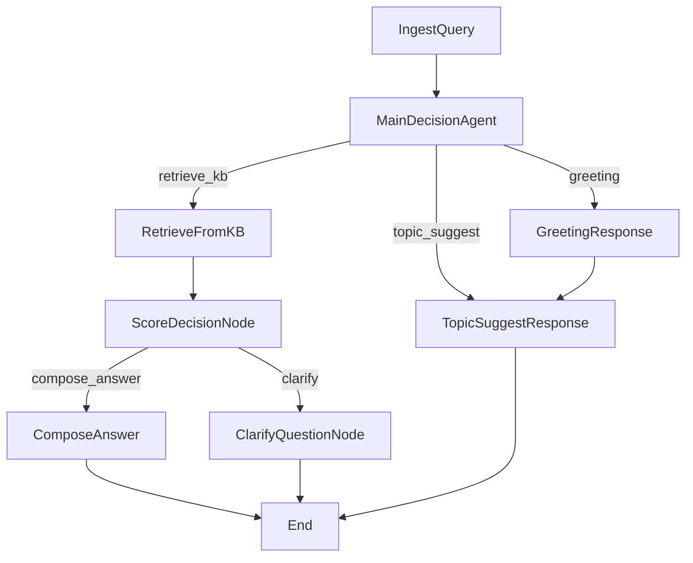

## Medical Agent Flow (Updated Architecture)

This document describes the current modular execution flow using PocketFlow framework. The system uses a multi-agent approach with specialized nodes for different aspects of medical conversation handling.

### Overall Flow Architecture

### Node Descriptions

#### 1. IngestQuery
- **Purpose**: Entry point for all user inputs
- **Function**: Normalizes and validates user input and role
- **Input**: `role`, `input` from shared store
- **Output**: Processed `query` and `role` to shared store
- **Routing**: Always routes to `MainDecisionAgent` via "default"

#### 2. MainDecisionAgent  
- **Purpose**: Central classification and routing agent
- **Function**: Uses LLM to classify user input and determine processing path
- **Classification Types**:
  - `medical_question`: Medical queries requiring KB search
  - `greeting`: Welcome/hello messages
  - `topic_suggest`: Requests for topic suggestions
  - `statement`: General statements
  - `nonsense`: Invalid/unclear inputs
- **Features**:
  - Generates RAG questions for enhanced retrieval
  - Provides classification confidence and reasoning
- **Routing**:
  - `medical_question` → RetrieveFromKB
  - `greeting` → GreetingResponse
  - Other types → TopicSuggestResponse

#### 3. RetrieveFromKB
- **Purpose**: Knowledge base search and retrieval
- **Function**: 
  - Searches role-specific medical knowledge base
  - Uses TF-IDF vectorization with cosine similarity
  - Combines original query with RAG questions for comprehensive search
- **Features**:
  - Role-based knowledge filtering
  - Top-K retrieval (default: 7 results)
  - Performance logging for optimization
- **Output**: Retrieved results and similarity scores
- **Routing**: Always routes to `ScoreDecisionNode`

#### 4. ScoreDecisionNode
- **Purpose**: Quality-based routing decision
- **Function**: Evaluates retrieval quality and routes to appropriate response handler
- **Logic**:
  - For `medical_question`:
    - High score (≥ threshold) → ComposeAnswer
    - Low score (< threshold) → ClarifyQuestionNode
  - Other types → ClarifyQuestionNode
- **Routing**:
  - `compose_answer`: High-confidence medical responses
  - `clarify`: Low-confidence or clarification needed
  - `topic_suggest`: Topic suggestions

#### 5. ComposeAnswer
- **Purpose**: Generate comprehensive medical answers
- **Function**:
  - Formats KB context with role-specific persona
  - Uses conversation history for context
  - Generates structured YAML responses with explanation and suggestions
- **Features**:
  - Role-based persona adaptation
  - Conversation history integration
  - Structured output with validation
- **Output**: Formatted medical advice with follow-up questions

#### 6. ClarifyQuestionNode
- **Purpose**: Handle low-confidence medical queries
- **Function**: 
  - Provides clarification message
  - Suggests related questions from KB or random sampling
- **Use Cases**:
  - Insufficient information for accurate response
  - Ambiguous medical queries
  - Need for more specific information

#### 7. TopicSuggestResponse
- **Purpose**: Provide topic exploration
- **Function**: 
  - Generates role-specific topic suggestions
  - Uses random sampling from knowledge base
- **Use Cases**:
  - User requests topic suggestions
  - General conversation starters
  - Exploration of available medical topics

#### 8. GreetingResponse
- **Purpose**: Handle greeting messages
- **Function**: Sets friendly context and routes to topic suggestions
- **Output**: Welcome message with transition to topic exploration

### Shared Store Data Flow

The system uses a shared store for communication between nodes. Key data structures:

#### Input Data
- `role`: User role (patient_dental, patient_diabetes, doctor_dental, doctor_endocrine)
- `input`: Raw user input text
- `conversation_history`: Previous conversation context

#### Processing Data  
- `query`: Normalized user query
- `input_type`: Classification result (medical_question, greeting, topic_suggest, etc.)
- `classification_confidence`: Confidence level of classification
- `classification_reason`: Reasoning behind classification
- `rag_questions`: Additional questions generated for enhanced retrieval

#### Knowledge Retrieval Data
- `retrieved`: List of retrieved KB entries with scores
- `retrieval_score`: Best similarity score from KB search
- `need_clarify`: Boolean indicating if clarification is needed

#### Response Data
- `answer_obj`: Structured response object
- `explain`: Main explanation/answer text
- `suggestion_questions`: Follow-up question suggestions
- `response_context`: Context for response generation

### API Integration

The FastAPI layer (`/api/chat`) consumes the following outputs:
- `explain`: Main response text displayed to user
- `suggestion_questions`: Clickable follow-up suggestions
- `input_type`: Used for response formatting and UI behavior

### Role-Based Knowledge Access

Each role has access to specific knowledge bases:
- `patient_dental` → `bnrhm.csv` (Bệnh nhân răng hàm mặt)
- `patient_diabetes` → `bndtd.csv` (Bệnh nhân đái tháo đường)  
- `doctor_dental` → `bsrhm.csv` (Bác sĩ răng hàm mặt)
- `doctor_endocrine` → `bsnt.csv` (Bác sĩ nội tiết)

### Performance Features

- **Retrieval Timing**: Performance logging for KB search optimization
- **Fallback Mechanisms**: Graceful handling of LLM failures
- **Structured Validation**: YAML schema validation for consistent outputs
- **Role-Specific Personas**: Tailored response tone and content per user role

