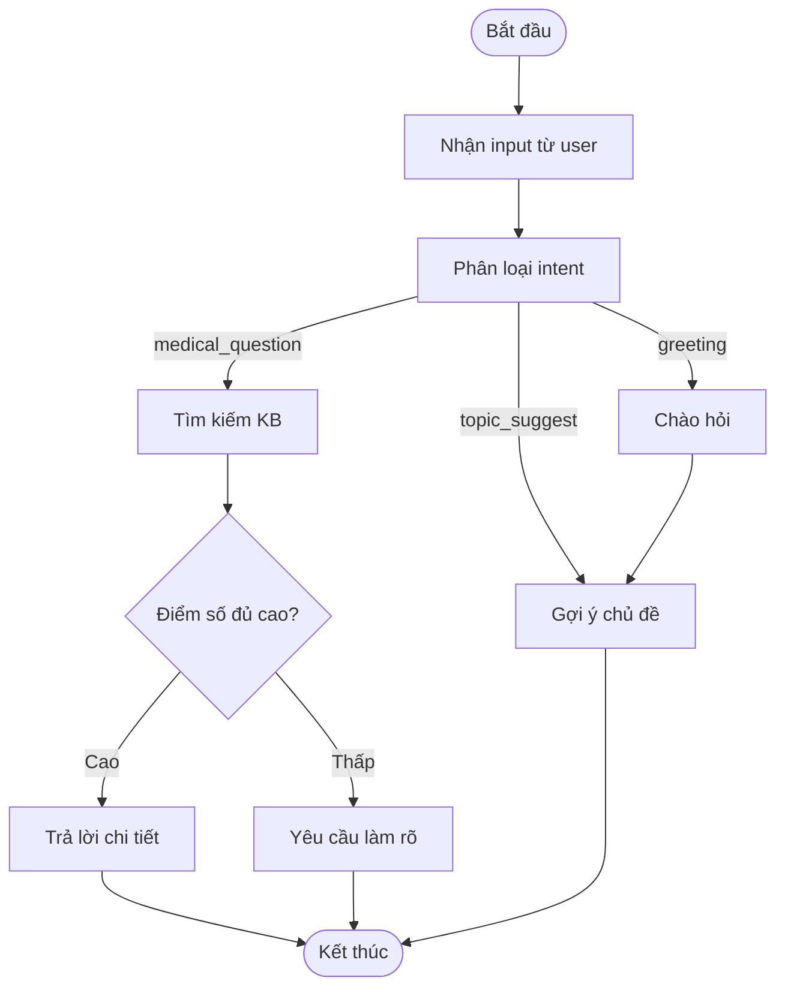
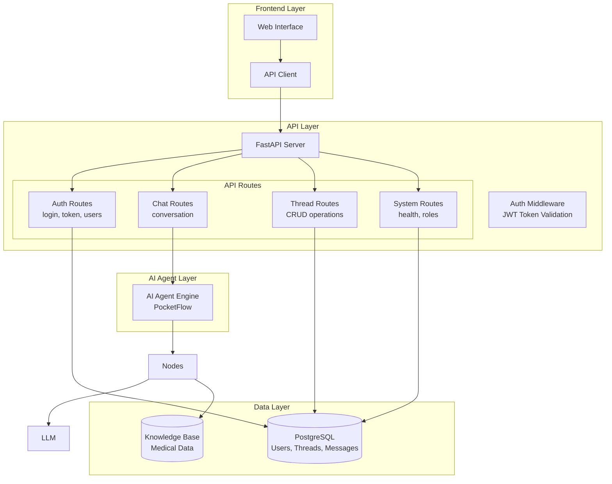
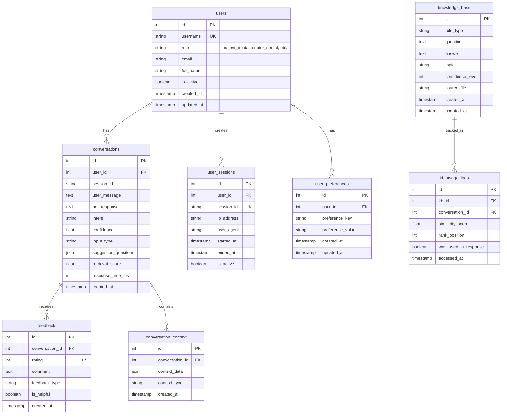

# Quy trình xây dựng Chatbot đa bệnh lý quan

## Tổng quan

Tài liệu này mô tả quy trình xây dựng một hệ thống chatbot y tế thông minh phục vụ đa bệnh lý quan (Răng Hàm Mặt và Nội Tiết), sử dụng kiến trúc multi-agent với PocketFlow framework.

## Quy trình 5 bước chính

### 1. Xác định yêu cầu & phạm vi (Nhu cầu của bác sĩ và bệnh nhân)

#### 1.1 Phân tích stakeholders
- **Bệnh nhân**: Cần thông tin y tế dễ hiểu, lời khuyên cơ bản
- **Bác sĩ**: Cần thông tin chuyên sâu, hỗ trợ chẩn đoán và điều trị

#### 1.2 Xác định phạm vi bệnh lý
- **Răng Hàm Mặt (RHM)**: Bệnh lý nha khoa, phẫu thuật hàm mặt
- **Nội Tiết**: Đái tháo đường, rối loạn hormone

#### 1.3 Yêu cầu chức năng
- Phân loại người dùng (bệnh nhân/bác sĩ)
- Tìm kiếm thông tin y tế theo vai trò
- Đưa ra lời khuyên phù hợp với từng đối tượng
- Gợi ý câu hỏi liên quan

#### 1.4 Yêu cầu phi chức năng
- Thời gian phản hồi < 3 giây
- Độ chính xác cao trong tư vấn y tế
- Giao diện thân thiện, dễ sử dụng

### 2. Phân tích nội dung & xây dựng kịch bản (Intent - Entity - Response, Dialogue flow)

#### 2.1 Phân tích Intent (Ý định)
```yaml
Intents:
  medical_question:
    description: "Câu hỏi y tế cần tìm kiếm trong KB"
    examples:
      - "Bệnh tiểu đường có triệu chứng gì?"
      - "Cách chữa sâu răng như thế nào?"
  
  greeting:
    description: "Chào hỏi, bắt đầu cuộc trò chuyện"
    examples:
      - "Xin chào"
      - "Hello"
  
  topic_suggest:
    description: "Yêu cầu gợi ý chủ đề"
    examples:
      - "Tôi nên hỏi gì?"
      - "Gợi ý chủ đề cho tôi"
```

#### 2.2 Xác định Entity (Thực thể)
```yaml
Entities:
  user_role:
    values:
      - patient_dental: "Bệnh nhân răng hàm mặt"
      - patient_diabetes: "Bệnh nhân đái tháo đường" 
      - doctor_dental: "Bác sĩ răng hàm mặt"
      - doctor_endocrine: "Bác sĩ nội tiết"
  
  medical_condition:
    values:
      - diabetes: "Đái tháo đường"
      - tooth_decay: "Sâu răng"
      - gum_disease: "Bệnh nướu"
```

#### 2.3 Thiết kế Dialogue Flow


#### 2.4 Thiết kế Response Templates
```python
RESPONSES = {
    "greeting": {
        "patient": "Xin chào! Tôi là trợ lý AI y tế. Tôi có thể giúp bạn tìm hiểu về {specialty}.",
        "doctor": "Chào bác sĩ! Tôi có thể hỗ trợ thông tin chuyên môn về {specialty}."
    },
    "clarification": "Bạn có thể cung cấp thêm thông tin chi tiết về {topic} không?",
    "no_answer": "Xin lỗi, tôi chưa có thông tin về vấn đề này. Bạn có thể hỏi về các chủ đề khác."
}
```

### 3. Thiết kế kiến trúc hệ thống (Backend, Database, Frontend, NLU)

#### 3.1 Kiến trúc tổng thể


#### 3.2 API Endpoints Chi tiết

> **Lưu ý về Authentication**: Các endpoints yêu cầu JWT Token cần gửi token trong header:
> ```
> Authorization: Bearer <your_jwt_token>
> ```

##### 3.2.1 Authentication Routes (`/api/auth/*`)
| Method | Endpoint | Mô tả | Authentication |
|--------|----------|-------|----------------|
| POST | `/api/auth/login` | Đăng nhập với username/password | None |
| POST | `/api/auth/token` | Refresh JWT token | JWT Token |

**Login Request Example:**
```json
{
    "username": "user@example.com",
    "password": "your_password"
}
```

**Login Response Example:**
```json
{
    "access_token": "eyJ0eXAiOiJKV1QiLCJhbGciOiJIUzI1NiJ9...",
    "token_type": "bearer",
    "expires_in": 3600,
    "user": {
        "id": 1,
        "username": "user@example.com",
        "email": "user@example.com",
        "created_at": "2024-01-15T10:30:00"
    }
}
```

##### 3.2.2 User Management Routes (`/api/users/*`)
| Method | Endpoint | Mô tả | Authentication |
|--------|----------|-------|----------------|
| POST | `/api/users` | Tạo tài khoản người dùng mới | None |
| GET | `/api/users` | Lấy danh sách tất cả users (admin) | JWT Token |
| GET | `/api/users/me` | Lấy thông tin user hiện tại | JWT Token |
| DELETE | `/api/users/{user_id}` | Xóa user theo ID | JWT Token |

##### 3.2.3 Chat Routes (`/api/chat`)
| Method | Endpoint | Mô tả | Authentication |
|--------|----------|-------|----------------|
| POST | `/api/chat` | Gửi tin nhắn và nhận phản hồi từ AI | JWT Token |

**Request Body Example:**
```json
{
    "message": "Tôi bị đau răng, làm sao để giảm đau?",
    "role": "patient_dental",
    "session_id": "thread-uuid-here"
}
```

**Response Example:**
```json
{
    "explanation": "Để giảm đau răng tạm thời, bạn có thể...",
    "questionSuggestion": [
        "Tôi nên sử dụng thuốc giảm đau nào?",
        "Khi nào tôi cần đi khám nha sĩ?"
    ],
    "session_id": "thread-uuid-here",
    "timestamp": "2024-01-15T10:30:00",
    "input_type": "question",
    "need_clarify": false
}
```

##### 3.2.4 Thread Management Routes (`/api/threads/*`)
| Method | Endpoint | Mô tả | Authentication |
|--------|----------|-------|----------------|
| GET | `/api/threads/` | Lấy danh sách tất cả threads của user | JWT Token |
| POST | `/api/threads/` | Tạo thread mới | JWT Token |
| GET | `/api/threads/{thread_id}` | Lấy thread cụ thể với tất cả messages | JWT Token |
| PUT | `/api/threads/{thread_id}/rename` | Đổi tên thread | JWT Token |
| DELETE | `/api/threads/{thread_id}` | Xóa thread và tất cả messages | JWT Token |
| GET | `/api/threads/threads/{thread_id}/messages` | Lấy messages của thread (có pagination) | JWT Token |

**Create Thread Request Example:**
```json
{
    "name": "Tư vấn đau răng khôn"
}
```

**Thread Response Example:**
```json
{
    "id": "thread-uuid-here",
    "name": "Tư vấn đau răng khôn",
    "user_id": 1,
    "created_at": "2024-01-15T10:30:00",
    "updated_at": "2024-01-15T10:30:00"
}
```

##### 3.2.5 System Routes (`/api/*`)
| Method | Endpoint | Mô tả | Authentication |
|--------|----------|-------|----------------|
| GET | `/api/` | Root endpoint với thông tin API | None |
| GET | `/api/health` | Health check endpoint | None |
| GET | `/api/roles` | Lấy danh sách các roles có sẵn | None |

**Roles Response Example:**
```json
{
    "roles": [
        {
            "id": "patient_dental",
            "name": "Bệnh nhân Nha khoa",
            "description": "Bệnh nhân cần tư vấn về vấn đề nha khoa"
        },
        {
            "id": "doctor_dental",
            "name": "Bác sĩ Nha khoa",
            "description": "Bác sĩ chuyên khoa nha khoa"
        }
    ],
    "default_role": "patient_dental",
    "timestamp": "2024-01-15T10:30:00"
}
```

#### 3.3 Database Schema

##### 3.3.1 Relational Diagram


##### 3.2.2 Database Tables
```sql
-- Bảng người dùng (mở rộng)
CREATE TABLE users (
    id SERIAL PRIMARY KEY,
    username VARCHAR(50) UNIQUE NOT NULL,
    email VARCHAR(100) UNIQUE,
    full_name VARCHAR(100),
    role VARCHAR(20) NOT NULL, -- patient_dental, doctor_dental, etc.
    is_active BOOLEAN DEFAULT true,
    created_at TIMESTAMP DEFAULT CURRENT_TIMESTAMP,
    updated_at TIMESTAMP DEFAULT CURRENT_TIMESTAMP
);

-- Bảng phiên làm việc
CREATE TABLE user_sessions (
    id SERIAL PRIMARY KEY,
    user_id INTEGER REFERENCES users(id) ON DELETE CASCADE,
    session_id VARCHAR(100) UNIQUE NOT NULL,
    ip_address INET,
    user_agent TEXT,
    started_at TIMESTAMP DEFAULT CURRENT_TIMESTAMP,
    ended_at TIMESTAMP,
    is_active BOOLEAN DEFAULT true
);

-- Bảng lịch sử trò chuyện (mở rộng)
CREATE TABLE conversations (
    id SERIAL PRIMARY KEY,
    user_id INTEGER REFERENCES users(id) ON DELETE CASCADE,
    session_id VARCHAR(100) NOT NULL,
    user_message TEXT NOT NULL,
    bot_response TEXT NOT NULL,
    intent VARCHAR(50),
    confidence FLOAT,
    input_type VARCHAR(30),
    suggestion_questions JSON,
    retrieval_score FLOAT,
    response_time_ms INTEGER,
    created_at TIMESTAMP DEFAULT CURRENT_TIMESTAMP,
    
    INDEX idx_user_id (user_id),
    INDEX idx_session_id (session_id),
    INDEX idx_created_at (created_at),
    INDEX idx_intent (intent)
);

-- Bảng ngữ cảnh cuộc trò chuyện
CREATE TABLE conversation_context (
    id SERIAL PRIMARY KEY,
    conversation_id INTEGER REFERENCES conversations(id) ON DELETE CASCADE,
    context_data JSON NOT NULL,
    context_type VARCHAR(50), -- 'retrieved_kb', 'user_state', 'flow_state'
    created_at TIMESTAMP DEFAULT CURRENT_TIMESTAMP
);

-- Bảng feedback (mở rộng)
CREATE TABLE feedback (
    id SERIAL PRIMARY KEY,
    conversation_id INTEGER REFERENCES conversations(id) ON DELETE CASCADE,
    rating INTEGER CHECK (rating >= 1 AND rating <= 5),
    comment TEXT,
    feedback_type VARCHAR(30) DEFAULT 'general', -- 'general', 'accuracy', 'helpfulness'
    is_helpful BOOLEAN,
    created_at TIMESTAMP DEFAULT CURRENT_TIMESTAMP
);

-- Bảng knowledge base (chuẩn hóa từ CSV)
CREATE TABLE knowledge_base (
    id SERIAL PRIMARY KEY,
    role_type VARCHAR(30) NOT NULL, -- patient_dental, doctor_dental, etc.
    question TEXT NOT NULL,
    answer TEXT NOT NULL,
    topic VARCHAR(100),
    confidence_level INTEGER CHECK (confidence_level >= 1 AND confidence_level <= 5),
    source_file VARCHAR(50),
    created_at TIMESTAMP DEFAULT CURRENT_TIMESTAMP,
    updated_at TIMESTAMP DEFAULT CURRENT_TIMESTAMP,
    
    INDEX idx_role_type (role_type),
    INDEX idx_topic (topic),
    FULLTEXT INDEX idx_question (question),
    FULLTEXT INDEX idx_answer (answer)
);

-- Bảng log sử dụng knowledge base
CREATE TABLE kb_usage_logs (
    id SERIAL PRIMARY KEY,
    kb_id INTEGER REFERENCES knowledge_base(id) ON DELETE CASCADE,
    conversation_id INTEGER REFERENCES conversations(id) ON DELETE CASCADE,
    similarity_score FLOAT NOT NULL,
    rank_position INTEGER NOT NULL,
    was_used_in_response BOOLEAN DEFAULT false,
    accessed_at TIMESTAMP DEFAULT CURRENT_TIMESTAMP,
    
    INDEX idx_conversation_id (conversation_id),
    INDEX idx_similarity_score (similarity_score),
    INDEX idx_accessed_at (accessed_at)
);

-- Bảng tùy chọn người dùng
CREATE TABLE user_preferences (
    id SERIAL PRIMARY KEY,
    user_id INTEGER REFERENCES users(id) ON DELETE CASCADE,
    preference_key VARCHAR(50) NOT NULL,
    preference_value TEXT,
    created_at TIMESTAMP DEFAULT CURRENT_TIMESTAMP,
    updated_at TIMESTAMP DEFAULT CURRENT_TIMESTAMP,
    
    UNIQUE KEY unique_user_preference (user_id, preference_key)
);

-- Bảng phân tích hiệu suất
CREATE TABLE performance_metrics (
    id SERIAL PRIMARY KEY,
    metric_name VARCHAR(50) NOT NULL,
    metric_value DECIMAL(10,4),
    metric_unit VARCHAR(20),
    recorded_at TIMESTAMP DEFAULT CURRENT_TIMESTAMP,
    metadata JSON,
    
    INDEX idx_metric_name (metric_name),
    INDEX idx_recorded_at (recorded_at)
);
```

##### 3.2.3 Indexes và Constraints
```sql
-- Thêm indexes cho performance
CREATE INDEX idx_conversations_user_created ON conversations(user_id, created_at DESC);
CREATE INDEX idx_feedback_rating ON feedback(rating);
CREATE INDEX idx_kb_role_confidence ON knowledge_base(role_type, confidence_level);

-- Thêm constraints
ALTER TABLE conversations ADD CONSTRAINT chk_confidence 
    CHECK (confidence >= 0 AND confidence <= 1);

ALTER TABLE conversations ADD CONSTRAINT chk_retrieval_score 
    CHECK (retrieval_score >= 0 AND retrieval_score <= 1);

-- Triggers để tự động update timestamp
CREATE OR REPLACE FUNCTION update_updated_at_column()
RETURNS TRIGGER AS $$
BEGIN
    NEW.updated_at = CURRENT_TIMESTAMP;
    RETURN NEW;
END;
$$ language 'plpgsql';

CREATE TRIGGER update_users_updated_at 
    BEFORE UPDATE ON users 
    FOR EACH ROW EXECUTE FUNCTION update_updated_at_column();

CREATE TRIGGER update_knowledge_base_updated_at 
    BEFORE UPDATE ON knowledge_base 
    FOR EACH ROW EXECUTE FUNCTION update_updated_at_column();
```

##### 3.2.4 Mối quan hệ và Business Logic

**Quan hệ chính:**
- **users ↔ conversations**: Một người dùng có thể có nhiều cuộc trò chuyện (1:N)
- **users ↔ user_sessions**: Một người dùng có thể có nhiều phiên làm việc (1:N)
- **conversations ↔ feedback**: Mỗi cuộc trò chuyện có thể có nhiều feedback (1:N)
- **conversations ↔ conversation_context**: Mỗi cuộc trò chuyện có thể có nhiều context (1:N)
- **knowledge_base ↔ kb_usage_logs**: Mỗi KB entry có thể được sử dụng nhiều lần (1:N)

**Use Cases Database:**

```sql
-- Query 1: Lấy lịch sử trò chuyện của user với phân trang
SELECT c.id, c.user_message, c.bot_response, c.intent, c.confidence, c.created_at
FROM conversations c
WHERE c.user_id = ? AND c.created_at >= NOW() - INTERVAL '30 days'
ORDER BY c.created_at DESC
LIMIT 20 OFFSET ?;

-- Query 2: Thống kê hiệu suất theo intent
SELECT 
    intent,
    COUNT(*) as total_conversations,
    AVG(confidence) as avg_confidence,
    AVG(retrieval_score) as avg_retrieval_score,
    AVG(response_time_ms) as avg_response_time
FROM conversations 
WHERE created_at >= NOW() - INTERVAL '7 days'
GROUP BY intent;

-- Query 3: Top KB entries được sử dụng nhiều nhất
SELECT 
    kb.question,
    kb.topic,
    COUNT(kul.id) as usage_count,
    AVG(kul.similarity_score) as avg_similarity,
    COUNT(CASE WHEN kul.was_used_in_response THEN 1 END) as times_used_in_response
FROM knowledge_base kb
LEFT JOIN kb_usage_logs kul ON kb.id = kul.kb_id
WHERE kul.accessed_at >= NOW() - INTERVAL '30 days'
GROUP BY kb.id, kb.question, kb.topic
ORDER BY usage_count DESC
LIMIT 10;

-- Query 4: Phân tích feedback theo role
SELECT 
    u.role,
    AVG(f.rating) as avg_rating,
    COUNT(f.id) as feedback_count,
    COUNT(CASE WHEN f.is_helpful = true THEN 1 END) as helpful_count
FROM feedback f
JOIN conversations c ON f.conversation_id = c.id
JOIN users u ON c.user_id = u.id
WHERE f.created_at >= NOW() - INTERVAL '30 days'
GROUP BY u.role;

-- Query 5: Session analysis
SELECT 
    DATE(us.started_at) as session_date,
    COUNT(DISTINCT us.user_id) as unique_users,
    COUNT(us.id) as total_sessions,
    AVG(EXTRACT(EPOCH FROM (us.ended_at - us.started_at))/60) as avg_session_minutes
FROM user_sessions us
WHERE us.started_at >= NOW() - INTERVAL '7 days'
AND us.ended_at IS NOT NULL
GROUP BY DATE(us.started_at)
ORDER BY session_date DESC;
```

##### 3.2.5 Data Migration từ CSV sang Database

```python
# utils/migrate_csv_to_db.py
import pandas as pd
import psycopg2
from datetime import datetime

def migrate_csv_to_knowledge_base():
    """Migration script để chuyển data từ CSV files sang database"""
    
    # Mapping CSV files to roles
    csv_mappings = {
        'medical_knowledge_base/bnrhm.csv': 'patient_dental',
        'medical_knowledge_base/bndtd.csv': 'patient_diabetes', 
        'medical_knowledge_base/bsrhm.csv': 'doctor_dental',
        'medical_knowledge_base/bsnt.csv': 'doctor_endocrine'
    }
    
    conn = psycopg2.connect(
        host="localhost",
        database="chatbot_db",
        user="postgres",
        password="password"
    )
    
    cursor = conn.cursor()
    
    for csv_file, role_type in csv_mappings.items():
        print(f"Migrating {csv_file} for role {role_type}...")
        
        # Read CSV
        df = pd.read_csv(csv_file)
        
        # Insert each row
        for _, row in df.iterrows():
            cursor.execute("""
                INSERT INTO knowledge_base 
                (role_type, question, answer, topic, confidence_level, source_file)
                VALUES (%s, %s, %s, %s, %s, %s)
            """, (
                role_type,
                row.get('cau_hoi', ''),
                row.get('cau_tra_loi', ''),
                row.get('chu_de', ''),
                row.get('do_tin_cay', 3),  # Default confidence
                csv_file.split('/')[-1]
            ))
    
    conn.commit()
    cursor.close()
    conn.close()
    print("Migration completed!")

if __name__ == "__main__":
    migrate_csv_to_knowledge_base()
```

#### 3.3 Knowledge Base Structure
```
medical_knowledge_base/
├── bnrhm.csv     # Bệnh nhân răng hàm mặt
├── bndtd.csv     # Bệnh nhân đái tháo đường  
├── bsrhm.csv     # Bác sĩ răng hàm mặt
└── bsnt.csv      # Bác sĩ nội tiết

Cấu trúc CSV:
- cau_hoi: Câu hỏi
- cau_tra_loi: Câu trả lời
- chu_de: Chủ đề
- do_tin_cay: Độ tin cậy (1-5)
```

#### 3.4 NLU Components
- **Intent Classification**: Sử dụng LLM với prompt engineering
- **Entity Extraction**: Rule-based + LLM
- **Retrieval System**: TF-IDF + Cosine similarity
- **Response Generation**: Template-based + LLM

### 4. Phát triển nguyên mẫu (Lập trình intents, giao diện, chức năng cơ bản)

#### 4.1 Cài đặt Dependencies
```bash
pip install -r requirements.txt
```

#### 4.2 Cấu trúc thư mục dự án
```
chatbot-rhm-api/
├── api.py              # FastAPI app
├── main.py            # Entry point
├── flow.py            # PocketFlow workflow
├── nodes.py           # Specialized nodes
├── config.py          # Configuration
├── database/
│   ├── db.py          # Database connection
│   ├── models.py      # SQLAlchemy models
│   └── init.sql       # Database schema
├── utils/
│   ├── call_llm.py    # LLM wrapper
│   ├── kb.py          # Knowledge base utils
│   ├── prompts.py     # Prompt templates
│   └── helpers.py     # Helper functions
├── services/
│   └── chat_service.py # Business logic
├── routes/
│   └── chat_routes.py  # API endpoints
├── medical_knowledge_base/ # CSV files
└── requirements.txt
```

#### 4.3 Implement Core Nodes

##### 4.3.1 IngestQuery Node
```python
class IngestQuery(Node):
    """Node nhận và xử lý input từ user"""
    def prep(self, shared):
        role = shared.get("role", "")
        user_input = shared.get("input", "")
        return role, user_input

    def exec(self, inputs):
        role, user_input = inputs
        return {"role": role, "query": user_input.strip()}

    def post(self, shared, prep_res, exec_res):
        shared["role"] = exec_res["role"]
        shared["query"] = exec_res["query"]
        return "default"
```

##### 4.3.2 MainDecisionAgent Node
```python
class MainDecisionAgent(Node):
    """Node phân loại intent và routing"""
    def prep(self, shared):
        query = shared.get("query", "").strip()
        role = shared.get("role", "")
        return query, role
    
    def exec(self, inputs):
        query, role = inputs
        prompt = PROMPT_CLASSIFY_INPUT.format(query=query, role=role)
        resp = call_llm(prompt)
        result = parse_yaml_response(resp)
        return result
    
    def post(self, shared, prep_res, exec_res):
        shared["input_type"] = exec_res["type"]
        # Route based on classification
        if exec_res["type"] == "medical_question":
            return "retrieve_kb"
        elif exec_res["type"] == "greeting":
            return "greeting"
        else:
            return "topic_suggest"
```

##### 4.3.3 RetrieveFromKB Node
```python
class RetrieveFromKB(Node):
    """Node tìm kiếm thông tin từ knowledge base"""
    def prep(self, shared):
        query = shared.get("query", "")
        role = shared.get("role", "")
        return query, role

    def exec(self, inputs):
        query, role = inputs
        results, score = retrieve(query, role, top_k=7)
        return results, score

    def post(self, shared, prep_res, exec_res):
        results, score = exec_res
        shared["retrieved"] = results
        shared["retrieval_score"] = score
        return "default"
```

#### 4.4 Implement API Endpoints
```python
@app.post("/api/chat")
async def chat_endpoint(request: ChatRequest):
    """Main chat endpoint"""
    shared = {
        "role": request.role,
        "input": request.message,
        "conversation_history": request.conversation_history or []
    }
    
    # Run the flow
    flow = create_med_agent_flow()
    flow.run(shared)
    
    # Extract response
    response = ChatResponse(
        message=shared.get("explain", ""),
        suggestion_questions=shared.get("suggestion_questions", []),
        input_type=shared.get("input_type", ""),
        confidence=shared.get("classification_confidence", "")
    )
    
    return response
```

#### 4.5 Frontend Interface
```html
<!-- Chat Interface -->
<div class="chat-container">
    <div class="messages" id="messages">
        <!-- Messages will be displayed here -->
    </div>
    
    <div class="input-area">
        <select id="role-select">
            <option value="patient_dental">Bệnh nhân RHM</option>
            <option value="patient_diabetes">Bệnh nhân ĐTĐ</option>
            <option value="doctor_dental">Bác sĩ RHM</option>
            <option value="doctor_endocrine">Bác sĩ Nội tiết</option>
        </select>
        
        <input type="text" id="user-input" placeholder="Nhập câu hỏi...">
        <button onclick="sendMessage()">Gửi</button>
    </div>
    
    <div class="suggestions" id="suggestions">
        <!-- Suggestion buttons will appear here -->
    </div>
</div>
```

### 5. Kiểm thử nội bộ & hiệu chỉnh (Unit test, usability test, refine)

#### 5.1 Unit Testing

##### 5.1.1 Test Nodes
```python
# tests/test_nodes.py
import pytest
from nodes import IngestQuery, MainDecisionAgent, RetrieveFromKB

def test_ingest_query():
    node = IngestQuery()
    shared = {"role": "patient_dental", "input": "  Tôi bị đau răng  "}
    
    result = node.run(shared)
    
    assert shared["role"] == "patient_dental"
    assert shared["query"] == "Tôi bị đau răng"
    assert result == "default"

def test_main_decision_agent():
    node = MainDecisionAgent()
    shared = {"role": "patient_dental", "query": "Sâu răng có nguy hiểm không?"}
    
    result = node.run(shared)
    
    assert shared["input_type"] in ["medical_question", "greeting", "topic_suggest"]
    assert result in ["retrieve_kb", "greeting", "topic_suggest"]

def test_retrieve_from_kb():
    node = RetrieveFromKB()
    shared = {"role": "patient_dental", "query": "sâu răng"}
    
    result = node.run(shared)
    
    assert "retrieved" in shared
    assert "retrieval_score" in shared
    assert isinstance(shared["retrieved"], list)
    assert isinstance(shared["retrieval_score"], float)
```

##### 5.1.2 Test API Endpoints
```python
# tests/test_api.py
import pytest
from fastapi.testclient import TestClient
from api import app

client = TestClient(app)

def test_chat_endpoint():
    response = client.post("/api/chat", json={
        "message": "Tôi bị đau răng",
        "role": "patient_dental",
        "conversation_history": []
    })
    
    assert response.status_code == 200
    data = response.json()
    assert "message" in data
    assert "suggestion_questions" in data
    assert "input_type" in data

def test_health_endpoint():
    response = client.get("/health")
    assert response.status_code == 200
    assert response.json() == {"status": "healthy"}
```

##### 5.1.3 Test Knowledge Base
```python
# tests/test_kb.py
import pytest
from utils.kb import retrieve, load_kb_data

def test_load_kb_data():
    data = load_kb_data("patient_dental")
    assert isinstance(data, list)
    assert len(data) > 0
    assert "cau_hoi" in data[0]
    assert "cau_tra_loi" in data[0]

def test_retrieve():
    results, score = retrieve("sâu răng", "patient_dental", top_k=5)
    assert isinstance(results, list)
    assert len(results) <= 5
    assert isinstance(score, float)
    assert 0 <= score <= 1
```

#### 5.2 Integration Testing
```python
# tests/test_integration.py
def test_full_flow():
    """Test complete conversation flow"""
    from flow import create_med_agent_flow
    
    flow = create_med_agent_flow()
    shared = {
        "role": "patient_dental",
        "input": "Tôi bị đau răng khi ăn đồ lạnh",
        "conversation_history": []
    }
    
    flow.run(shared)
    
    # Verify output structure
    assert "explain" in shared
    assert "suggestion_questions" in shared
    assert "input_type" in shared
    assert shared["input_type"] in ["medical_question", "greeting", "topic_suggest"]
```

#### 5.3 Performance Testing
```python
# tests/test_performance.py
import time
import statistics

def test_response_time():
    """Test average response time"""
    from flow import create_med_agent_flow
    
    flow = create_med_agent_flow()
    times = []
    
    for i in range(10):
        shared = {
            "role": "patient_dental",
            "input": f"Câu hỏi test số {i}",
            "conversation_history": []
        }
        
        start_time = time.time()
        flow.run(shared)
        end_time = time.time()
        
        times.append(end_time - start_time)
    
    avg_time = statistics.mean(times)
    assert avg_time < 3.0, f"Average response time {avg_time:.2f}s exceeds 3s limit"
```

#### 5.4 Usability Testing

##### 5.4.1 Test Scenarios
```yaml
Test Cases:
  - name: "Bệnh nhân hỏi về triệu chứng"
    role: "patient_dental" 
    input: "Tôi bị đau răng khi nhai"
    expected_output: "Detailed medical advice with suggestions"
  
  - name: "Bác sĩ hỏi về điều trị"
    role: "doctor_dental"
    input: "Phác đồ điều trị viêm nướu"
    expected_output: "Professional treatment information"
  
  - name: "Câu hỏi không rõ ràng"
    role: "patient_dental"
    input: "Tôi cảm thấy không khỏe"
    expected_output: "Clarification questions"
```

##### 5.4.2 User Acceptance Criteria
- ✅ Phản hồi chính xác cho từng vai trò
- ✅ Thời gian phản hồi < 3 giây
- ✅ Gợi ý câu hỏi liên quan hữu ích
- ✅ Xử lý tốt câu hỏi không rõ ràng
- ✅ Giao diện thân thiện, dễ sử dụng

#### 5.5 Continuous Refinement

##### 5.5.1 Monitoring & Logging
```python
# utils/monitoring.py
import logging
import time
from functools import wraps

def log_performance(func):
    @wraps(func)
    def wrapper(*args, **kwargs):
        start_time = time.time()
        result = func(*args, **kwargs)
        end_time = time.time()
        
        logging.info(f"{func.__name__} took {end_time - start_time:.4f} seconds")
        return result
    return wrapper

# Log user interactions
def log_conversation(user_input, bot_response, intent, confidence):
    logging.info(f"User: {user_input}")
    logging.info(f"Bot: {bot_response[:100]}...")
    logging.info(f"Intent: {intent}, Confidence: {confidence}")
```

##### 5.5.2 A/B Testing Framework
```python
# utils/ab_testing.py
import random

class ABTestManager:
    def __init__(self):
        self.experiments = {}
    
    def add_experiment(self, name, variants):
        self.experiments[name] = variants
    
    def get_variant(self, experiment_name, user_id):
        if experiment_name not in self.experiments:
            return "control"
        
        # Simple hash-based assignment
        hash_val = hash(f"{experiment_name}_{user_id}") % 100
        variants = self.experiments[experiment_name]
        
        for variant, percentage in variants.items():
            if hash_val < percentage:
                return variant
            hash_val -= percentage
        
        return "control"

# Usage
ab_test = ABTestManager()
ab_test.add_experiment("prompt_style", {
    "formal": 50,
    "casual": 50
})
```

## Kết luận

Quy trình xây dựng chatbot y tế đa bệnh lý quan này đảm bảo:

1. **Phân tích kỹ lưỡng** nhu cầu người dùng và phạm vi bệnh lý
2. **Thiết kế có hệ thống** các intent, entity và dialogue flow
3. **Kiến trúc linh hoạt** với multi-agent approach
4. **Phát triển từng bước** với testing và monitoring tích hợp
5. **Cải tiến liên tục** dựa trên feedback và performance data

Hệ thống sử dụng PocketFlow framework để đảm bảo tính mô-đun, dễ bảo trì và mở rộng, phù hợp cho việc phát triển các ứng dụng AI phức tạp trong lĩnh vực y tế.
