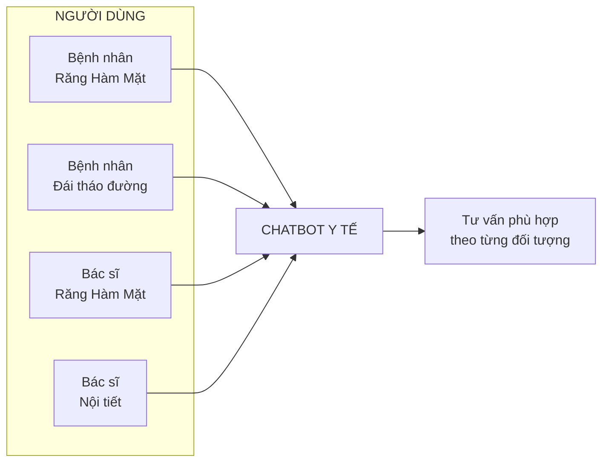
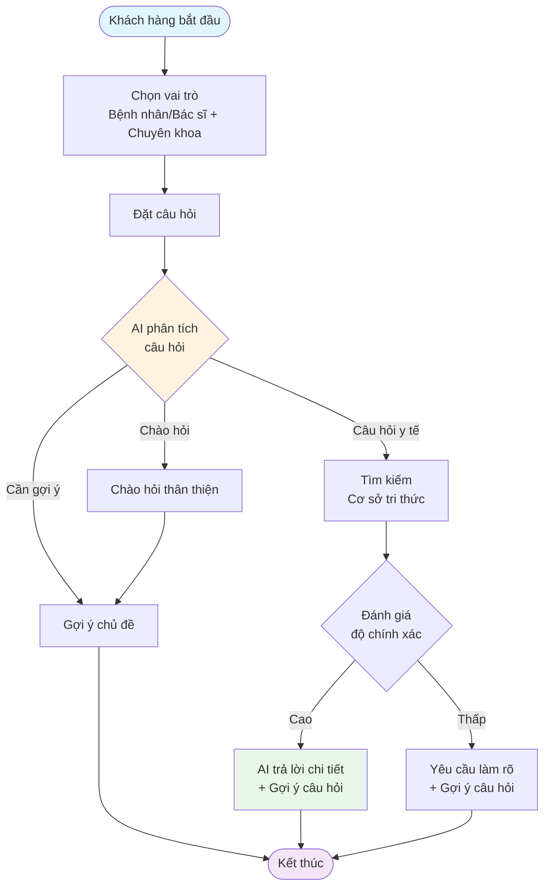
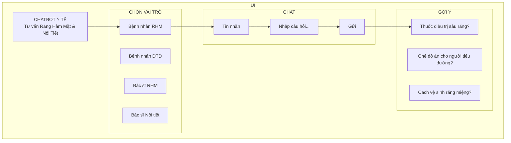
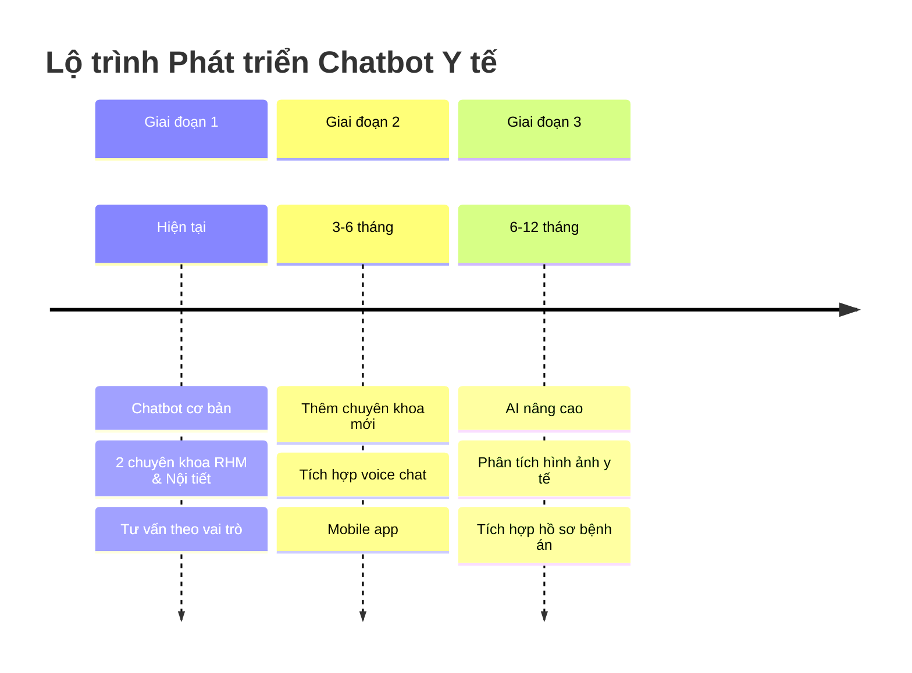

# Sơ đồ Hệ thống Chatbot Y tế - Dành cho Khách hàng

## Tổng quan Hệ thống

Chatbot Y tế thông minh phục vụ **2 chuyên khoa chính**:
- **Răng Hàm Mặt (RHM)**
- **Nội Tiết (Đái tháo đường)**

## 👥 Đối tượng Người dùng

## Quy trình Hoạt động

## Tính năng Chính

### **Cá nhân hóa theo Vai trò**
- **Bệnh nhân**: Ngôn ngữ dễ hiểu, lời khuyên cơ bản
- **Bác sĩ**: Thông tin chuyên môn, hỗ trợ chẩn đoán

### **AI Thông minh**
- Hiểu ý định câu hỏi
- Tìm kiếm thông tin chính xác
- Đưa ra câu trả lời phù hợp

### **Cơ sở Tri thức Phong phú**
- Hàng nghìn câu hỏi - đáp án
- Được cập nhật thường xuyên
- Phân loại theo chuyên khoa

### **Phản hồi Nhanh chóng**
- Thời gian phản hồi < 3 giây
- Hoạt động 24/7
- Giao diện thân thiện

## Giao diện Người dùng

## Lợi ích cho Khách hàng

### **Cho Bệnh nhân**
- Tư vấn y tế 24/7
- Thông tin dễ hiểu, đáng tin cậy  
- Gợi ý câu hỏi hữu ích
- Không cần chờ đợi

### **Cho Bác sĩ**
- Hỗ trợ tra cứu nhanh
- Thông tin chuyên môn cập nhật
- Tiết kiệm thời gian
- Hỗ trợ quyết định lâm sàng

## Đảm bảo Chất lượng

### **Độ chính xác cao**
- Cơ sở tri thức được kiểm duyệt bởi chuyên gia
- AI được huấn luyện với dữ liệu y tế chất lượng
- Hệ thống đánh giá độ tin cậy

### **An toàn thông tin**
- Không lưu trữ thông tin cá nhân nhạy cảm
- Tuân thủ quy định bảo mật y tế
- Mã hóa dữ liệu truyền tải

### **Cải tiến liên tục**
- Thu thập phản hồi người dùng
- Cập nhật kiến thức thường xuyên
- Tối ưu hiệu suất

## Roadmap Phát triển

## Liên hệ & Hỗ trợ

**Đơn vị phát triển**: Đội ngũ AI Y tế  
**Email hỗ trợ**: support@chatbot-yte.com  
**Hotline**: 1900-xxxx  
**Website**: www.chatbot-yte.com  

---

*Chatbot Y tế - Đồng hành cùng sức khỏe của bạn 24/7*
