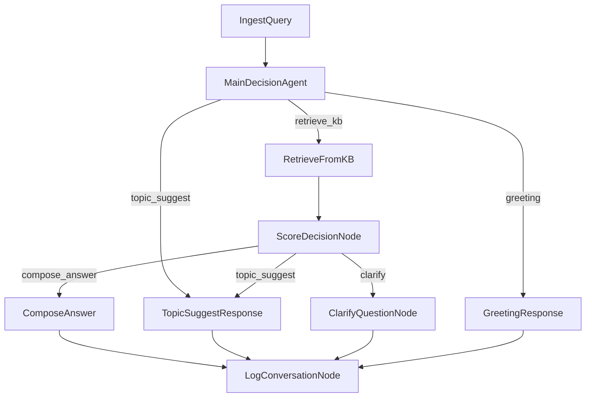

# Updated Medical Agent Flow - Separated Clarify and Topic Suggest Paths

## Flow Diagram



## Key Changes Made

### 1. **New ClarifyQuestionNode**
- **Purpose**: Handle low-score medical questions that need clarification
- **Message**: "Có thể bạn đang muốn hỏi về một trong những vấn đề sau đây? Hãy chọn câu hỏi phù hợp hoặc diễn đạt lại câu hỏi của bạn nhé! 🤔"
- **Questions**: Shows 5 related questions for focused clarification
- **Context**: Helps users refine their medical questions

### 2. **Updated ScoreDecisionNode**
- **Before**: Low-score medical questions → "topic_suggest" action
- **After**: Low-score medical questions → "clarify" action
- **Benefit**: Clear separation between clarification needs and topic exploration

### 3. **Simplified TopicSuggestResponse**
- **Before**: Handled both low-score medical and explicit topic requests
- **After**: Only handles explicit topic suggestion requests
- **Message**: "Mình gợi ý bạn các chủ đề sau nhé! Bạn có thể chọn bất kỳ chủ đề nào mà bạn quan tâm 😊"
- **Questions**: Shows 10 topic suggestions for broad exploration

### 4. **Updated Flow Routing**
- Added new routing path: `score_decision - "clarify" >> clarify_question`
- All response types now properly route to logging

## User Experience Improvements

### **Before** (Confusing UX)
```
User: "đau bụng" (low score)
Bot: "Hiện mình chưa tìm được câu trả lời trong dữ sẵn có. Bạn thông cảm nhé!. Mình có các hướng sau bạn có thể quan tâm."
[Shows 10 random questions]
```

### **After** (Clear UX)
```
User: "đau bụng" (low score)
Bot: "Có thể bạn đang muốn hỏi về một trong những vấn đề sau đây? Hãy chọn câu hỏi phù hợp hoặc diễn đạt lại câu hỏi của bạn nhé! 🤔"
[Shows 5 focused clarification questions]

User: "gợi ý chủ đề"
Bot: "Mình gợi ý bạn các chủ đề sau nhé! Bạn có thể chọn bất kỳ chủ đề nào mà bạn quan tâm 😊"
[Shows 10 topic exploration questions]
```

## Technical Benefits

1. **Separation of Concerns**: Different nodes for different purposes
2. **Better Maintainability**: Each node has a single, clear responsibility
3. **Improved UX**: Context-appropriate messages and question counts
4. **Clearer Intent**: Users understand whether they need to clarify or explore topics
5. **Easier Testing**: Each path can be tested independently
